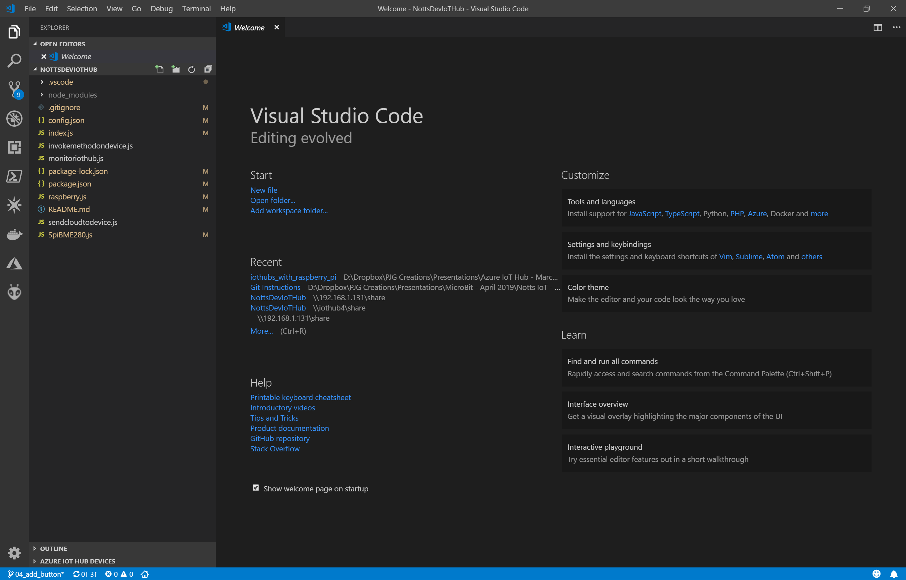

# Connecting to the Raspberry Pi #

## Make sure you've install Visual Studio Code! ##

- Connect to the network using the details provided
- Open Windows Explorer.
- In the Address bar type ```\\iothub``` + the number written on your Pi’s Network Socket and press Enter.
- If you're prompted for a Username and Password;

<p align="center">
    
</p>

- Enter ```Pi``` for the Username and ```raspberry``` for the Password.
- Check the "Remember my credentials" checkbox.
- Press the "OK" Button. 
- You should see the “share” folder on the Pi.

<p align="center">
    
</p>

- Right click on the Share Folder and click “Map Network Drive”;

<p align="center">
    
</p>

- The Map Network Drive window will be shown;

<p align="center">
    
</p>

- Press the “Finish” button.
- A new explorer window will open showing the “NottsDevIoTHub” Folder.

<p align="center">
    
</p>

- Go ahead and go into this directory to show the contents of the project;

<p align="center">
    
</p>

- Right click in any empty space and click “Open in Code” to open your project in code;

<p align="center">
    
</p>

- Visual Studio Code will open the code folder;

<p align="center">
    
</p>

| Previous | Next |
| -------- | ---- |
| [< Introduction](/README.md) | [Step 2 - SSH Into the Pi >](/02_ssh_into_pi/README.md) |