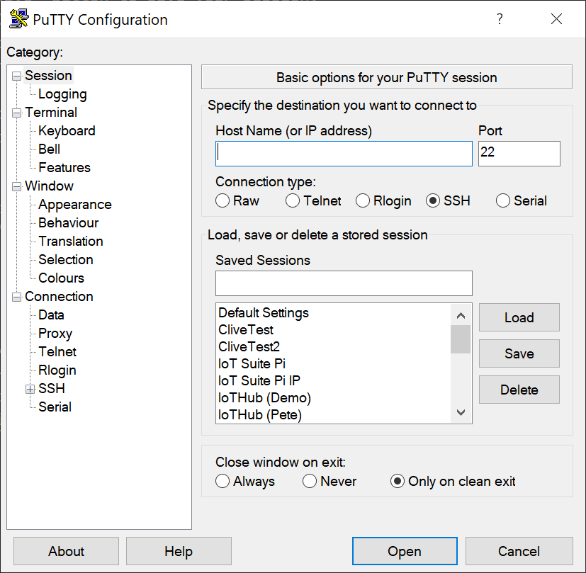
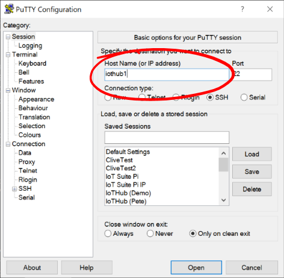
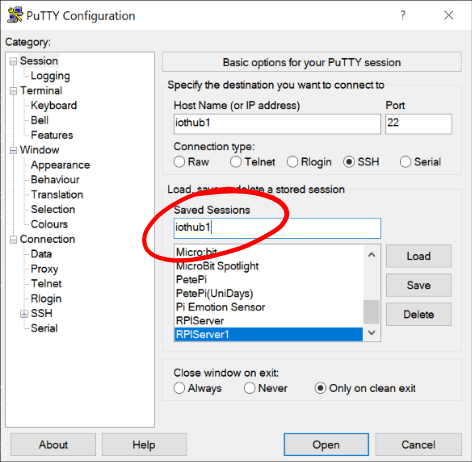
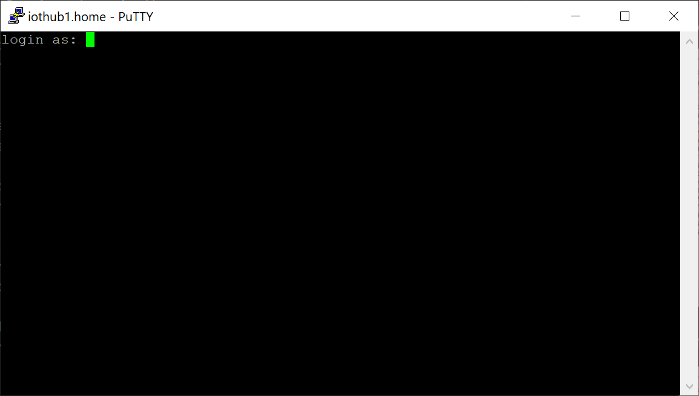
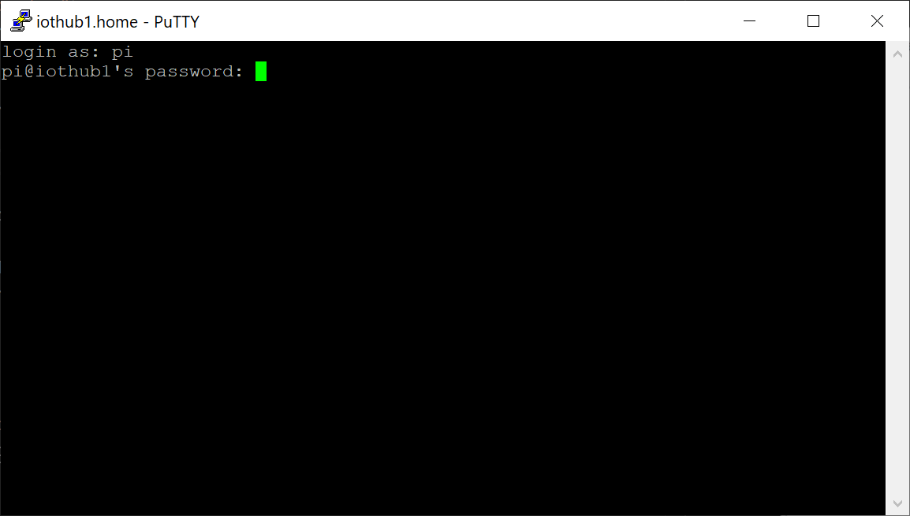
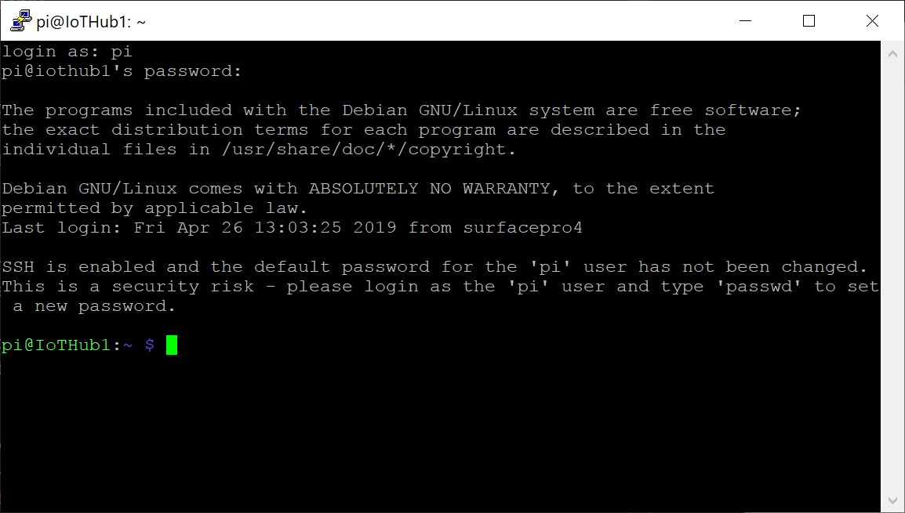
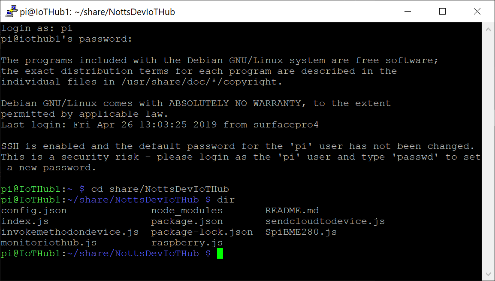

# Connecting to the Raspberry Pi #

## Make sure you’ve installed PuTTY! ##

- Open PuTTY;

<p align="center">
    
</p>

- In Host Name type in iothub + the number on your Pi’s network socket.

<p align="center">
    
</p>

- In Saved Sessions type in the same name;

<p align="center">
    
</p>

- Press the “Save” button to save your session.
- Press the “Open” button to start your SSH session;

<p align="center">
    
</p>

- At the prompt “login as:” type “pi”;

<p align="center">
    
</p>

- Use “raspberry” for the password and hit enter.
- The SSH Session will show the details of the Operating System on the Pi and default to the Pi Home Directory;

<p align="center">
    
</p>

- Navigate to the code directory by typing the following  (Remember the casing is important!).;

```cd share/NottsDevIoTHub```

- Type ```dir``` to see the same code files as your project.

<p align="center">
    
</p>

| Previous | Next |
| -------- | ---- |
| [< Step 1 - Connecting to the Raspberry Pi](/01_connecting_to_the_pi/README.md) | [Step 3 - Checking that the Code is Working >](/03_check_code_running/README.md) |