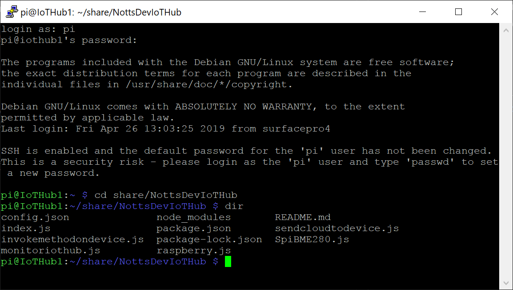
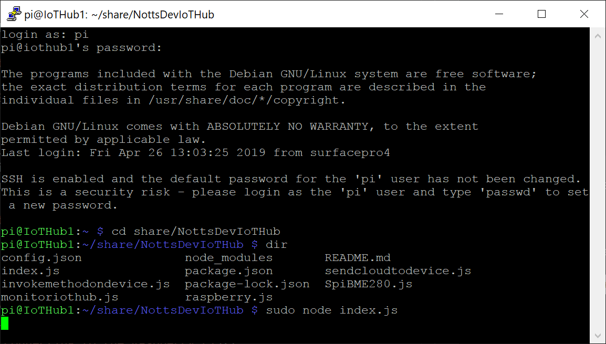
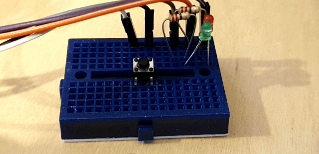
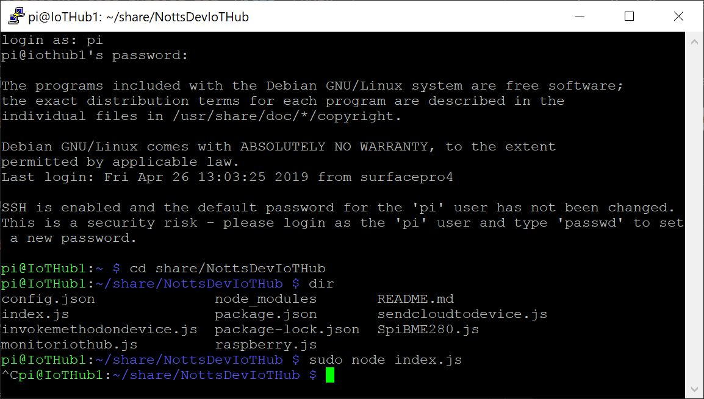

# 03 - Check the Code is Running #

- Still in PuTTY… Make sure you’re in the “share/NottsDevIoTHub” Directory;

<p align="center">
    
</p>

- Type the following and press enter;

```sudo node index.js```

- The code will start and seem to be doing nothing;

<p align="center">
    
</p>

- Press the Button on your BreadBoard.
- The LED’s will light up;

<p align="center">
    
</p>

- Press “ctrl+c” to stop your code.

<p align="center">
    
</p>

| Previous | Next |
| -------- | ---- |
| [< Step 1 - Connecting to the Raspberry Pi](/01_connecting_to_the_pi/README.md) | [Step 3 - Checking that the Code is Working >](/03_check_code_running/README.md) |