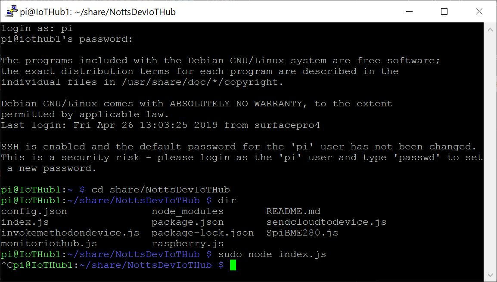
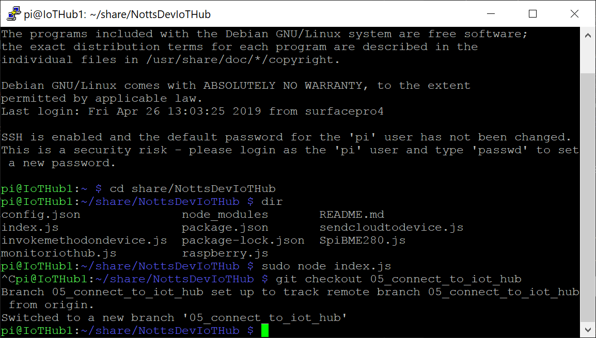

# 04 - Raspberry Pi Azure IoT Hub Setup #

- Still in PuTTY… Make sure you’re in the “share/NottsDevIoTHub” Directory;

<p align="center">
    
</p>

- Type the following and press enter (Remember that this is case-sensitive);

```git checkout 05_connect_to_iot_hub```

- The terminal should say ```Your branch is up-to-date with 'origin/05_connect_to_iot_hub'.```;

<p align="center">
    
</p>

| Previous | Next |
| -------- | ---- |
| [< Step 3 - Check the Code is Running](/03_check_code_running/README.md) | [Step 5 - Adding a "security.json" file >](/05_add_security_json/README.md) |