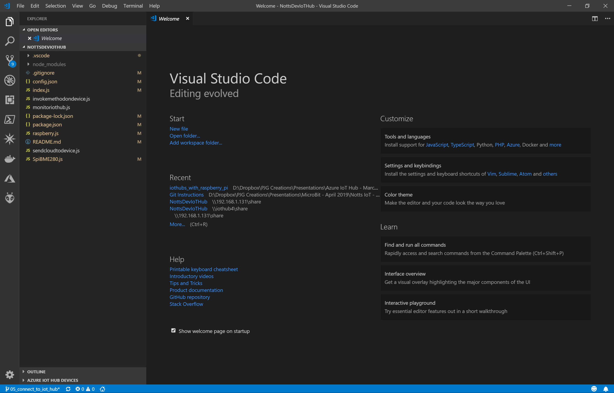
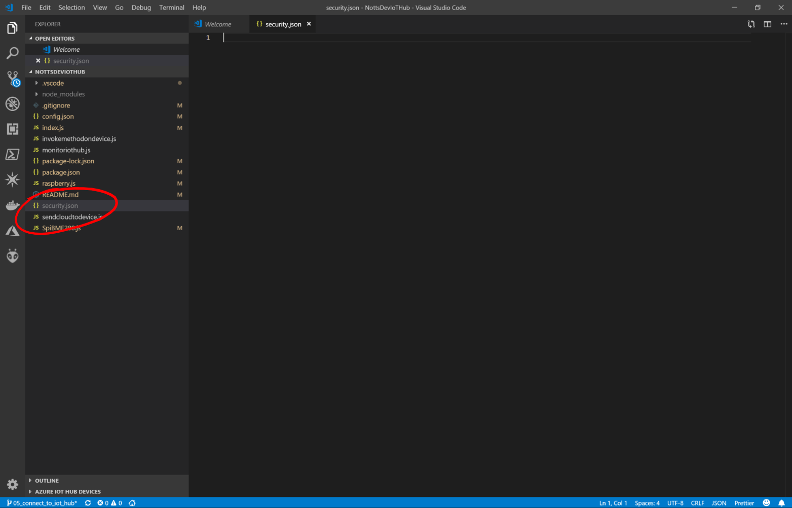
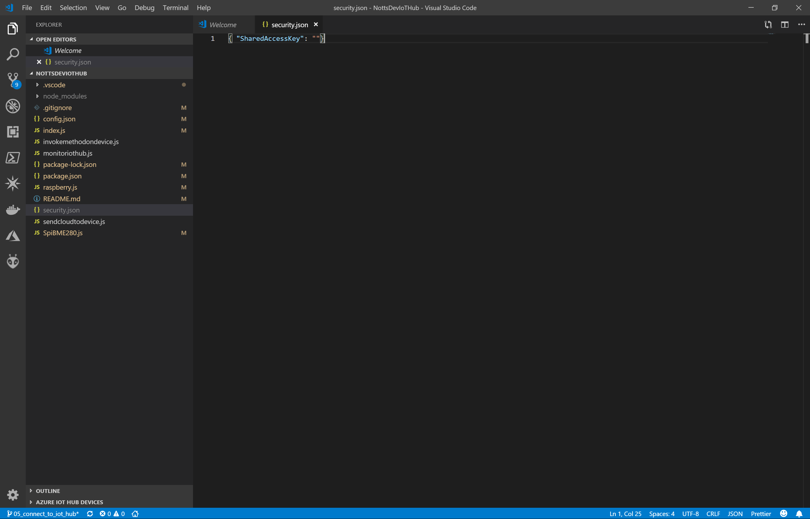

# 05 - Add security.json file #

Here we're going to add a file which will contain the key needed for our Pi to connect to an Azure IoT Hub.

---

- Return to Visual Studio Code;

<p align="center">
    
</p>

- Add a new file called “security.json”, using ```File > New File```;

<p align="center">
    
</p>

- Add the following code;

```{ "SharedAccessKey": ""}```

- Your file should look like the following;

<p align="center">
    
</p>

- Save the File.

| Previous | Next |
| -------- | ---- |
| [< Step 4 - Raspberry Pi Azure Setup](/04_pi_azure_setup/README.md) | [Step 6 - Creating an Azure IoT Hub >](/06_create_iot_hub/README.md) |