# 06 - Create an Azure IoT Hub #

We're now going to create an Azure IoT Hub through the Azure Portal.

## Make sure you've created an Azure Subscription! ##

---

- Goto ```portal.azure.com``` in which ever browser you prefer;

<p align="center">
    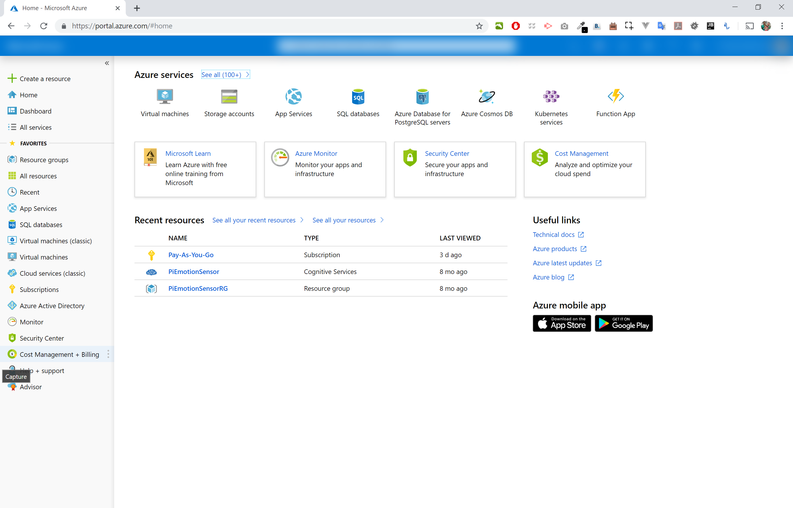
</p>

- Click “+ Create a Resource” in the top left;

<p align="center">
    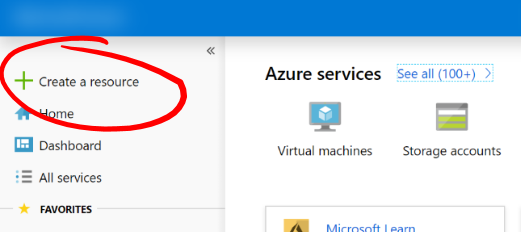
</p>

- Type ```IoT Hub``` in the ```Search the Marketplace``` text box.
- Select ```IoT Hub``` which should be the first item in the list;

<p align="center">
    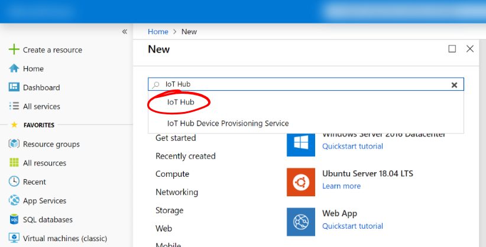
</p>

- Press the ```Create``` button in the bottom right hand corner;

<p align="center">
    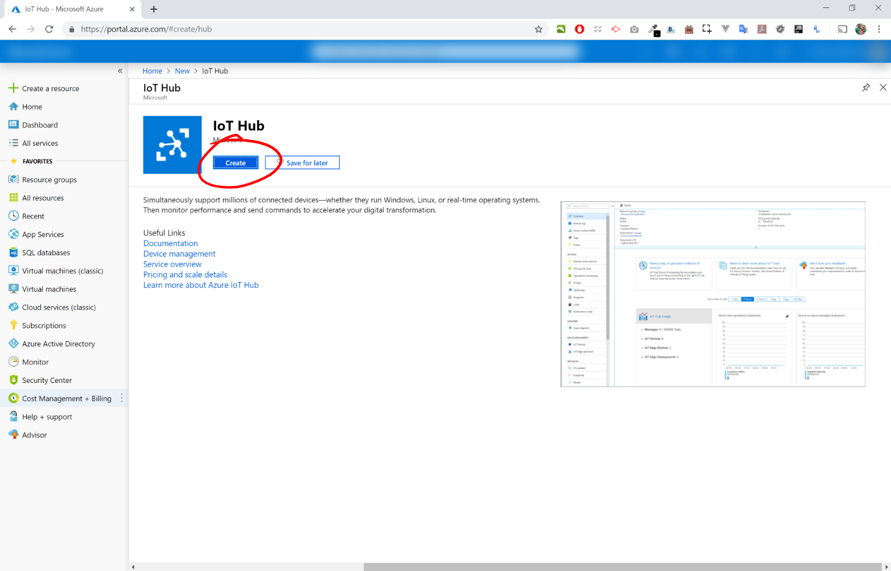
</p>

- In ```Subscription``` choose whichever subscription you’d like to use;

<p align="center">
    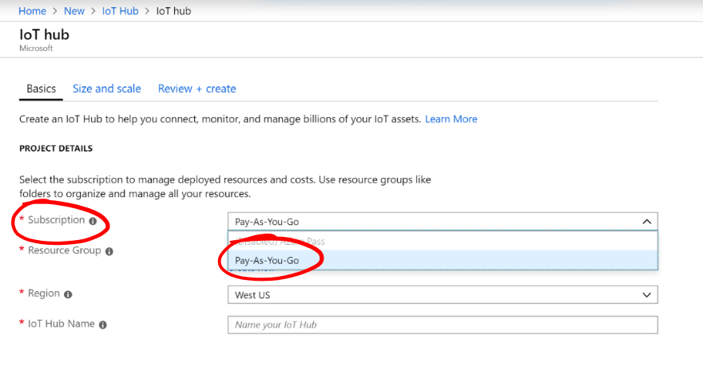
</p>

- In ```Resource Group``` click the ```Create new``` link and enter a name for your Resource Group, e.g. ```iothubrg``` and press the ```OK``` button;

<p align="center">
    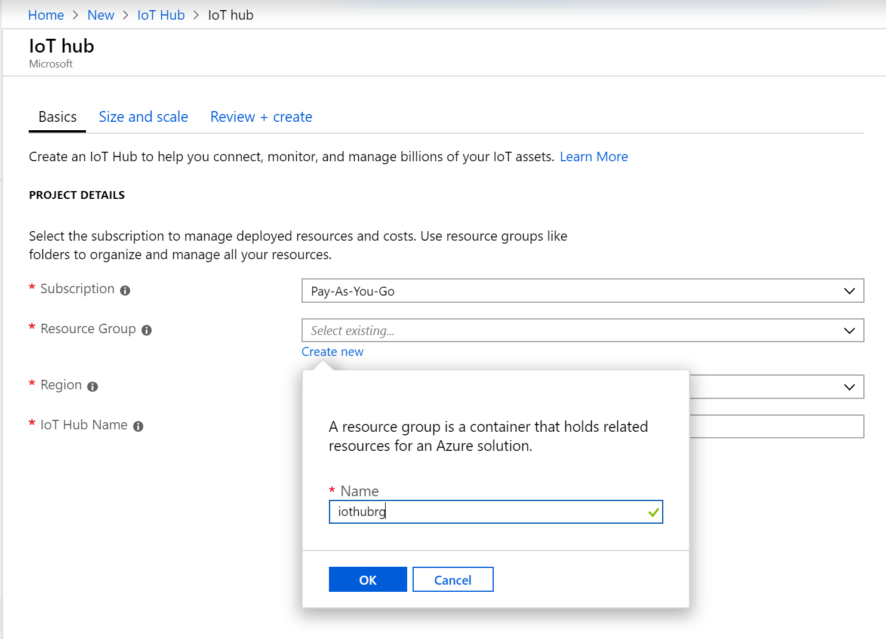
</p>

- In ```Region```, choose ```UK West```;

<p align="center">
    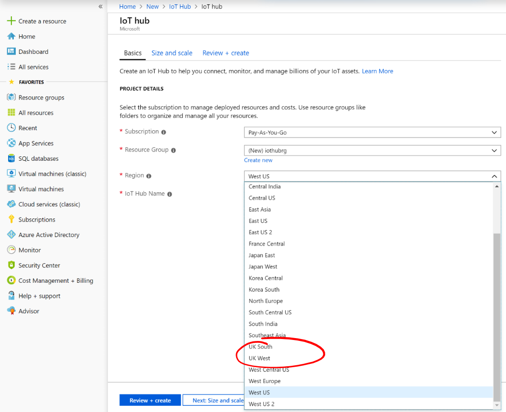
</p>

- In “IoT Hub Name” enter a name for you IoTHub. Use something that’s like to be unique e.g. ```petesiothub1```;

<p align="center">
    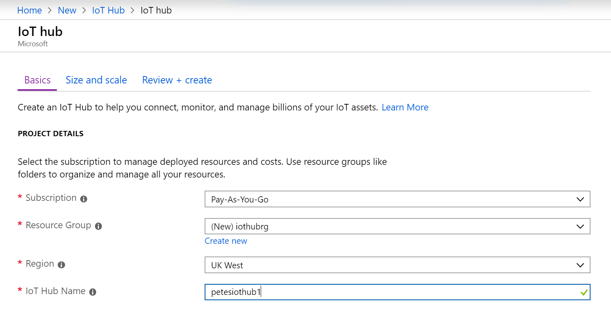
</p>

- Press the “Next: Sizing and Scale” button at the bottom of the screen;

<p align="center">
    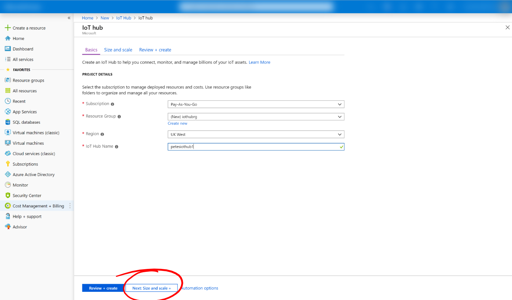
</p>

- From the “Pricing and scaling tier” dropdown, select the “F1 Free” option;

<p align="center">
    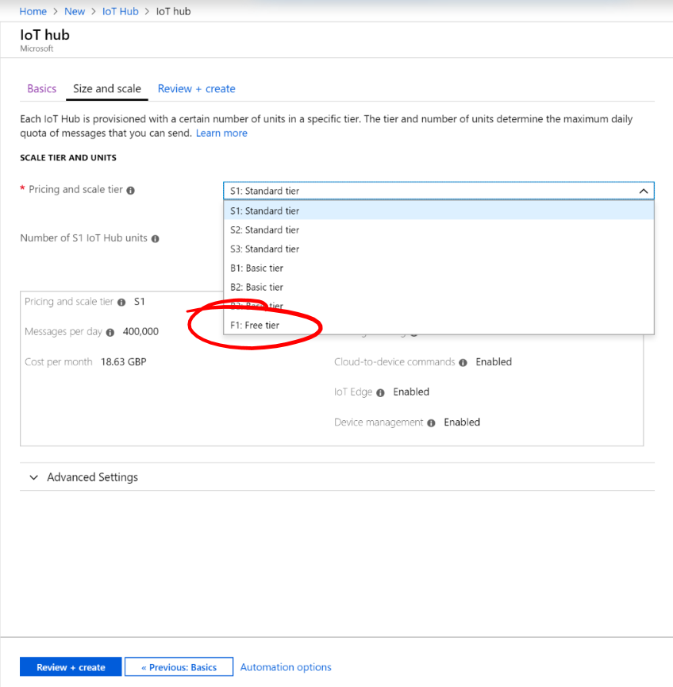
</p>

- Leave all the other settings as default.
- Press the “Review + create” button;

<p align="center">
    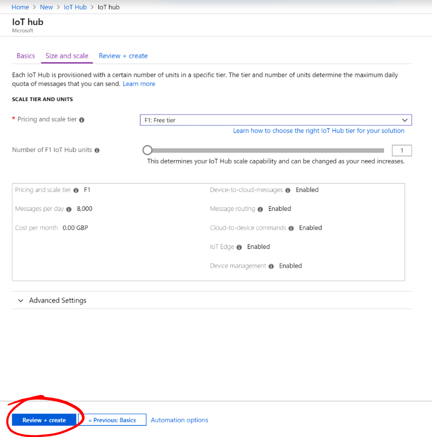
</p>

- Check your settings.
- Press the “Create” button at the bottom of the screen;

<p align="center">
    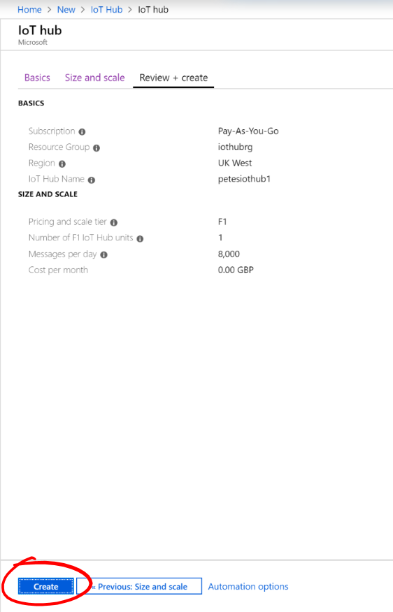
</p>

- The IoT Hub will begin deploying...
- You can monitor its progress by staying on the Overview page;

<p align="center">
    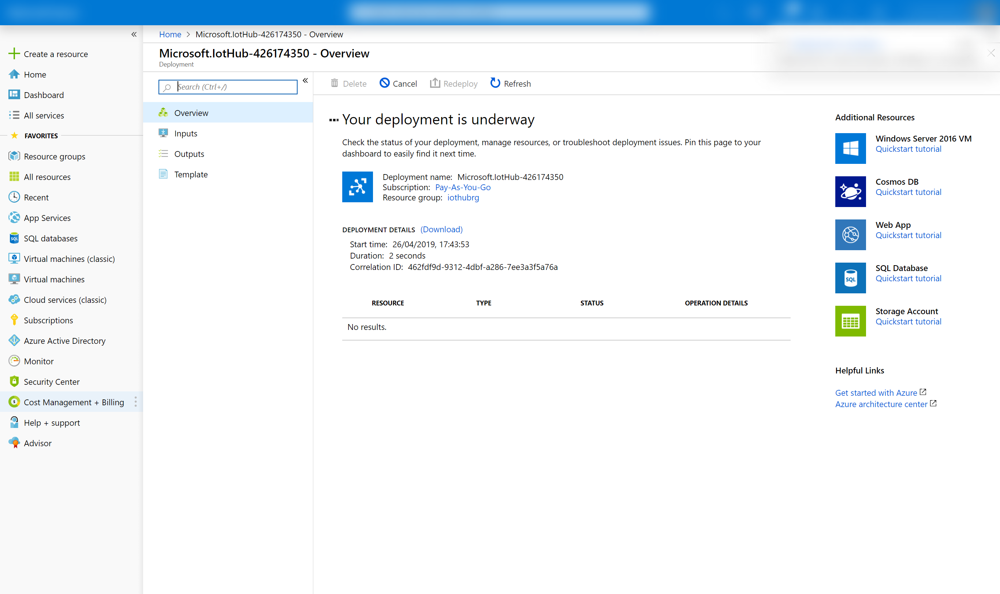
</p>

- Or you can click the “Notification” icon (A bell) in the top right corner;

<p align="center">
    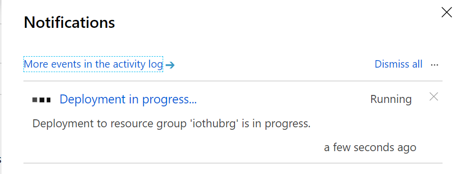
</p>

- This may take a minute or so to complete.

- While it’s deploying, double check that you’ve got the “Azure IoT Device Explorer Twin” installed

- When it’s completed deploying click the “Go to Resource” button to go to your new IoT hub.

<p align="center">
    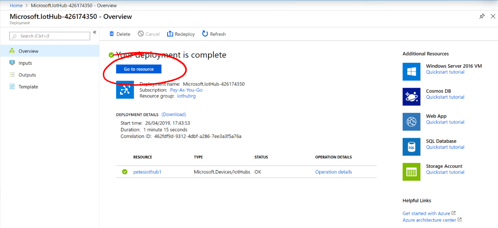
</p>

| Previous | Next |
| -------- | ---- |
| [< Step 4 - Raspberry Pi Azure Setup](/04_pi_azure_setup/README.md) | [Step 6 - Creating an Azure IoT Hub >](/06_create_iot_hub/README.md) |