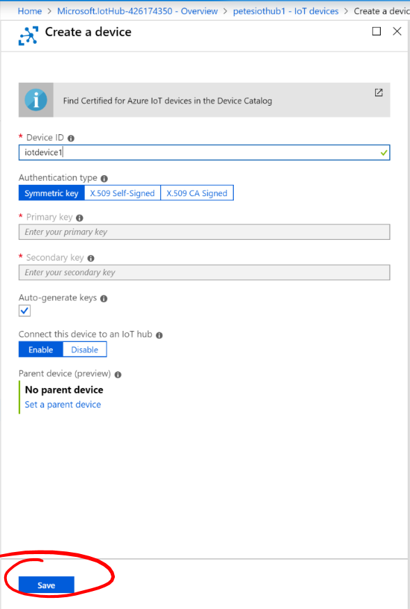

# 06 - Create an Azure IoT Hub #

We're now going to create an Azure IoT Device within our IoT Hub.

---

- Still in ```portal.azure.com```, make sure you’re in your new IoT Hub;

<p align="center">
    
</p>

- Under ```Explorers``` select ```IoT Devices```;

<p align="center">
    
</p>

- Press the ```+ Add``` button;

<p align="center">
    
</p>

- In ```Device ID``` type ```iotdevice1```;

<p align="center">
    
</p>

- Make sure that ```Connect this device to an IoT Hub``` is set to ```Enable```;

<p align="center">
    
</p>

- Leave the options as default.
- Press the ```Save``` button.

<p align="center">
    
</p>

| Previous | Next |
| -------- | ---- |
| [< Step 6 - Creating an Azure IoT Hub](/06_create_iot_hub/README.md) | [Step 8 - Creating a Shared Access Policy >](/08_create_shared_access/README.md) |