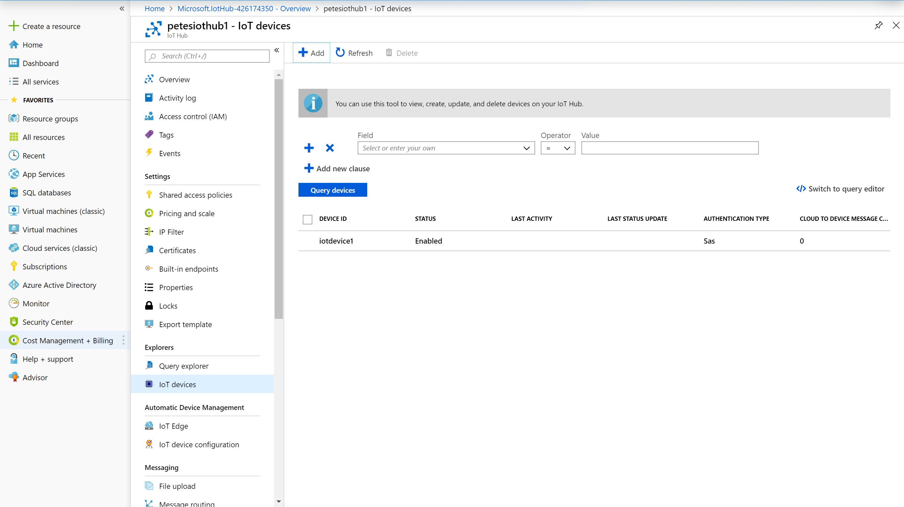
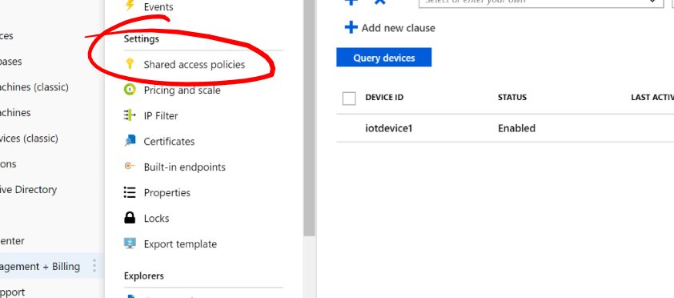
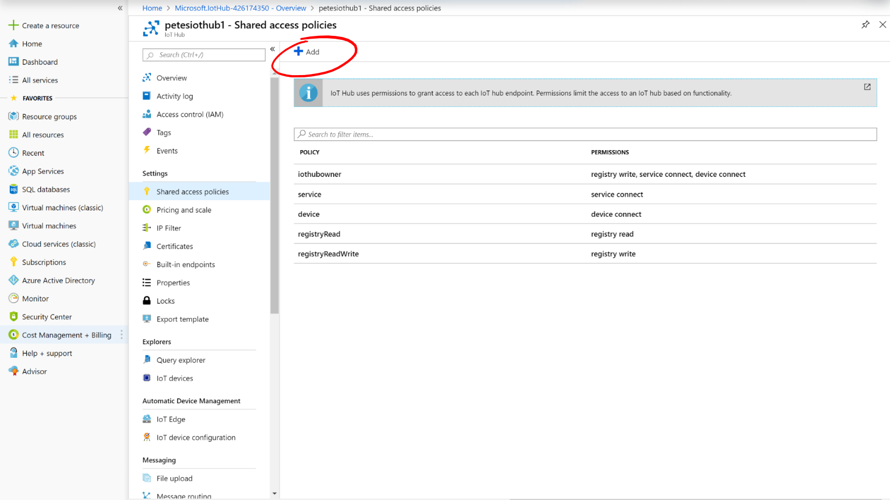
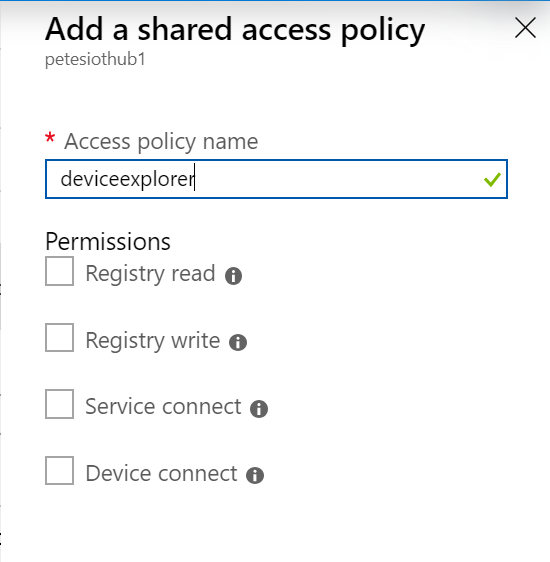
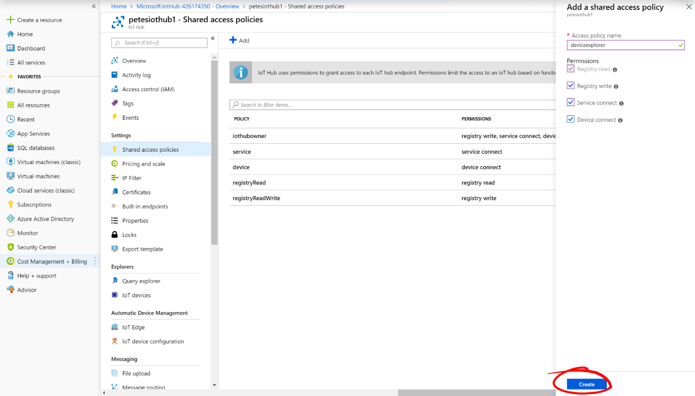
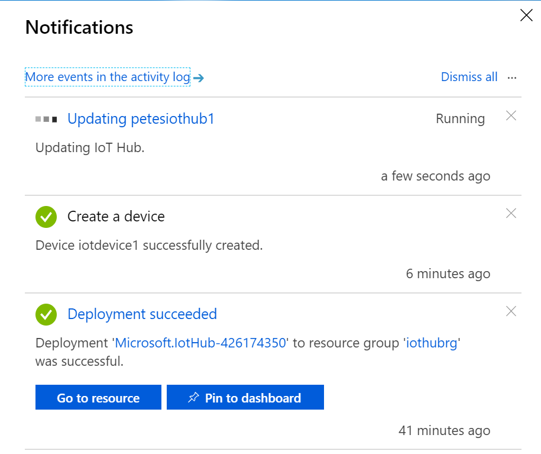
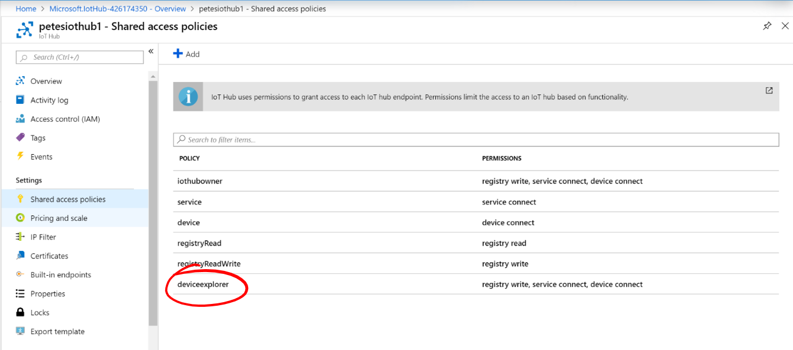
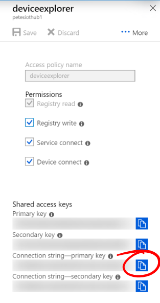

# 08 - Create a Shared Access Policy #

We're now going to create a Shared Access Policy. This will allow us to connect to the IoT Hub with monitoring tools like the Device Explorer Twin.

---

- Still in ```portal.azure.com```, make sure you’re in your new IoT Hub;

<p align="center">
    
</p>

- Under ```Settings``` select ```Shared access policies```;

<p align="center">
    
</p>

- Press the ```+ Add``` button at the top;

<p align="center">
    
</p>

- In ```Access policy name``` type ```deviceexplorer```;

<p align="center">
    
</p>

- Tick all of the permissions;

<p align="center">
    
</p>

- Press the “Create” button at the Bottom;

<p align="center">
    
</p>

- Wait for the IoTHub to be updated...
- Check the Notification Area for progress updates;

<p align="center">
    
</p>

- When the Policy has been created, click its name in the list of policies;

<p align="center">
    
</p>

- Click the ```Copy``` icon next to ```Connection string – primary key``` to copy the connection string to your clipboard;

<p align="center">
    
</p>

| Previous | Next |
| -------- | ---- |
| [< [Step 7 - Creating an IoT Device ](/07_create_iot_device/README.md) | [Step 9 - Using the Device Explorer Twin >](/09_device_explorer_twin/README.md) |