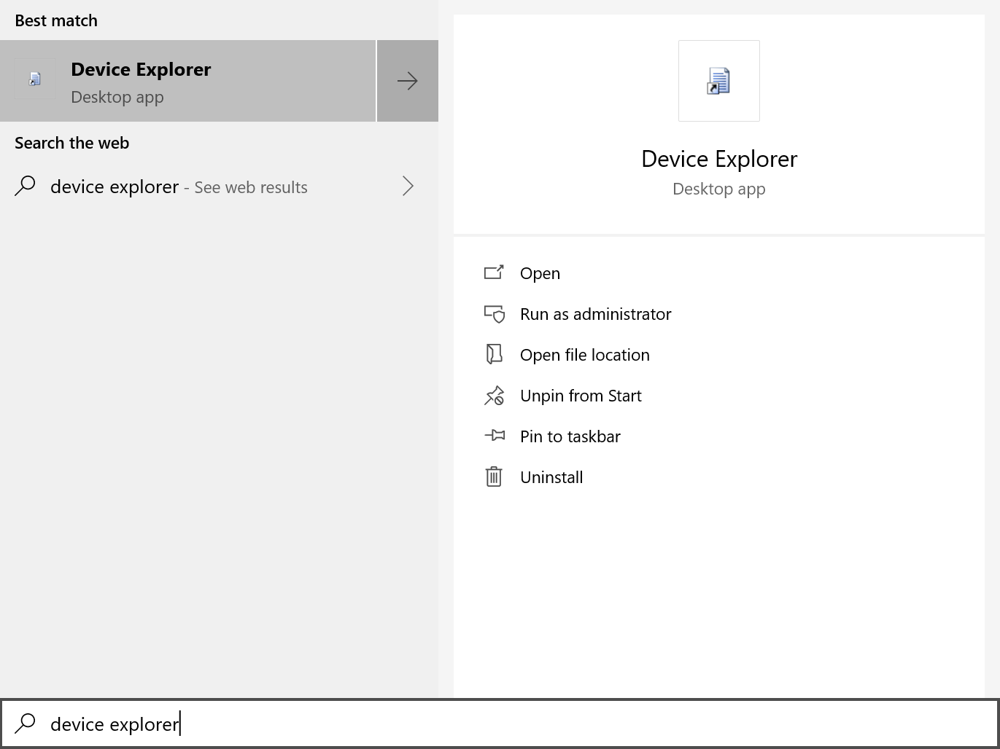
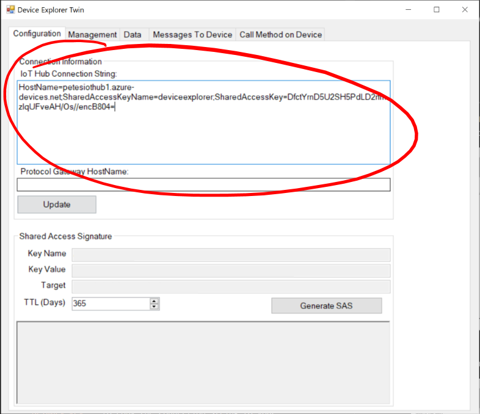
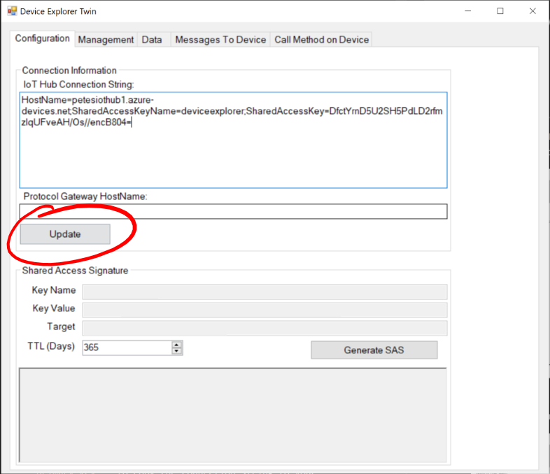
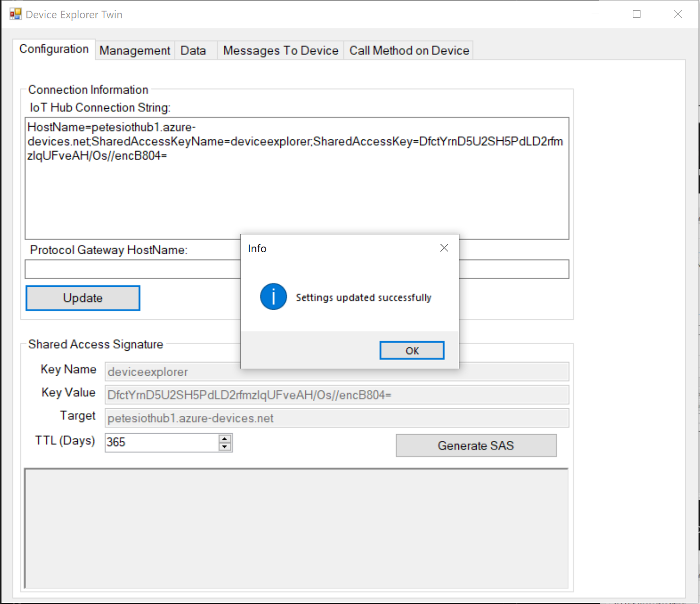
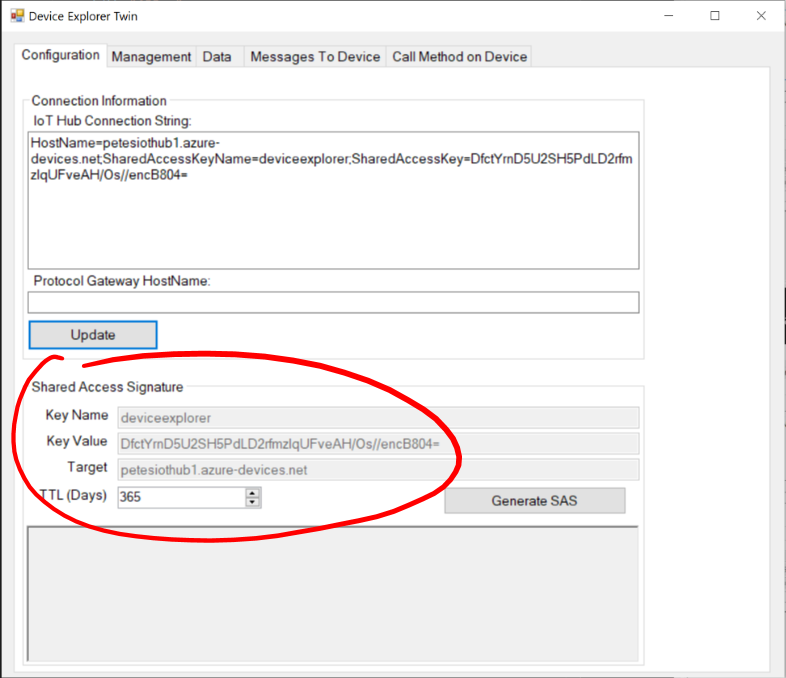
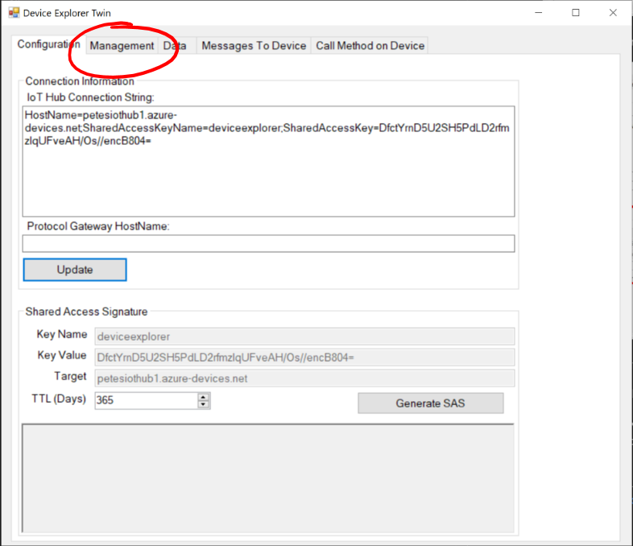
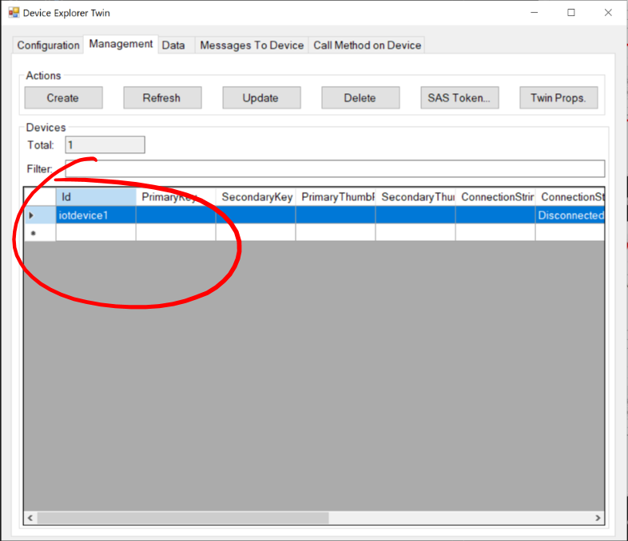

# 09 - Using the Windows Device Explorer Twin #

We're now going to use the Windows Device Explorer Twin to interact with our new IoT Hub...

## Make sure you've downloaded the Azure IoT Hub Device Explorer ##

---

- Open the ```Azure IoT Device Explorer Twin``` by searching for ```Device Explorer``` in your Start Menu and clicking on the shortcut;

<p align="center">
    
</p>

- In the ```Configuration``` tab, in the ```IoT Hub Connection String``` box, paste in your copied connection string;

<p align="center">
    
</p>

- Press the ```Update``` Button;

<p align="center">
    
</p>

- You should get a message box saying ```Settings Updated Successfully```;

<p align="center">
    
</p>

- The details in the ```Shared Access Signature``` box should update accordingly;

<p align="center">
    
</p>

- Click the ```Management``` tab at the top;

<p align="center">
    
</p>

- The ```Devices``` list should populate automatically with your “iotdevice1” device.

<p align="center">
    
</p>

| Previous | Next |
| -------- | ---- |
| [< Step 8 - Creating a Shared Access Policy](/08_create_shared_access/README.md) | [Step 10 - Using Visual Studio Code IoT Toolkit >](/10_vs_code_iot_toolkit/README.md) |