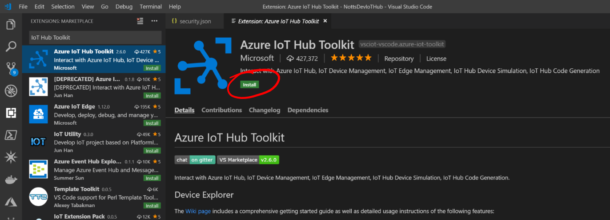

# 09 - Using the Windows Device Explorer Twin #

We're now going to use the Visual Studio Code IoT Toolkit Extension to Connect to our Azure IoT Hub.

---

- Return to Visual Studio Code;

<p align="center">
    
</p>

- Press the Extensions button on the left hand side;

<p align="center">
    
</p>

- In the Search Box type ```IoT Hub Toolkit``` and select the ```Azure IoT Hub Toolkit``` result;

<p align="center">
    
</p>

- Click the Green ```Install``` Button and wait for the extension to install;

<p align="center">
    
</p>

- Reload VS code if prompted.
- Return to your project files by pressing the ```Explorer``` icon;

<p align="center">
    
</p>

- Click the new tab at the bottom left – ```Azure IoT Hub Devices```;

<p align="center">
    
</p>

- If nothing appears in the tab, hover over the ```Azure IoT Hub Devices``` tab title and click the settings ellipses;

<p align="center">
    
</p>

- Press the ```Set IoT Hub Connection String``` item;

<p align="center">
    
</p>

- A Prompt will show at the top of the screen;

<p align="center">
    
</p>

- Paste in the same Connection String from Step 8 above, and press the Enter key.
- Your ```iotdevice1``` should be shown in the ```Azure IoT Hub Devices```;

<p align="center">
    
</p>

| Previous | Next |
| -------- | ---- |
| [< Step 9 - Using the Device Explorer Twin ](/09_device_explorer_twin/README.md) | [Step 11 - Connecting the Raspberry Pi to the IoT hub >](/11_connect_pi_to_iot_hub/README.md) |