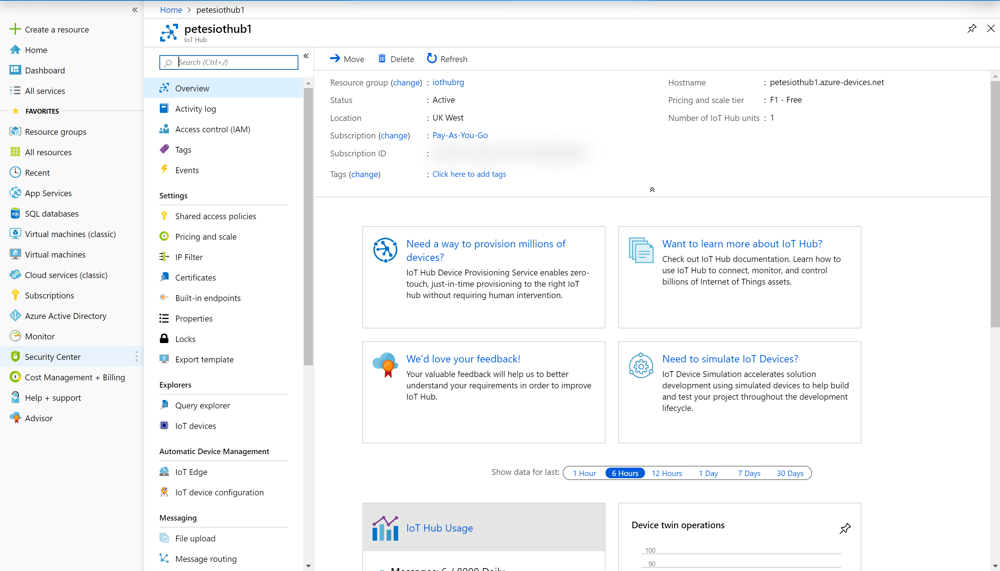
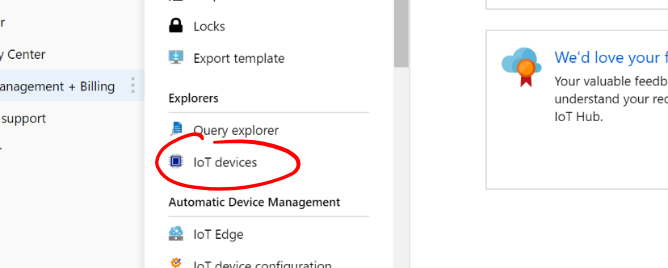
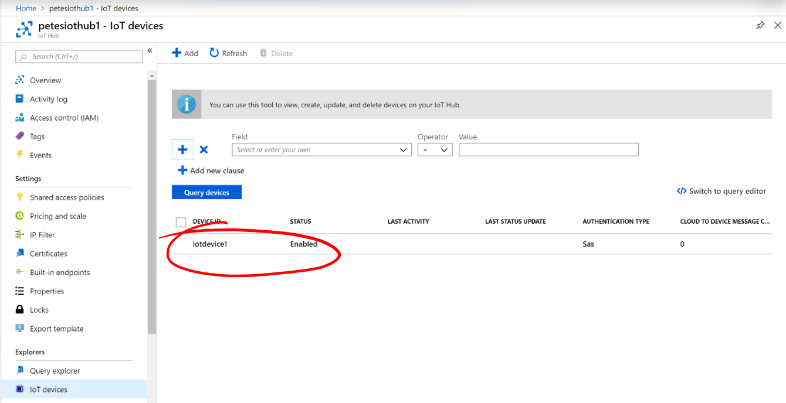
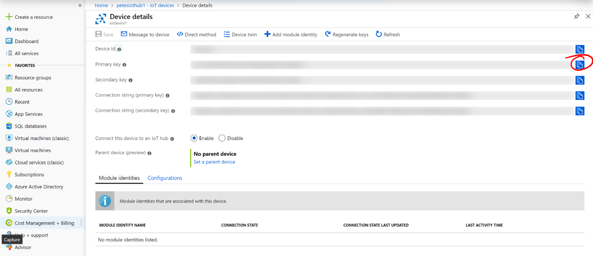
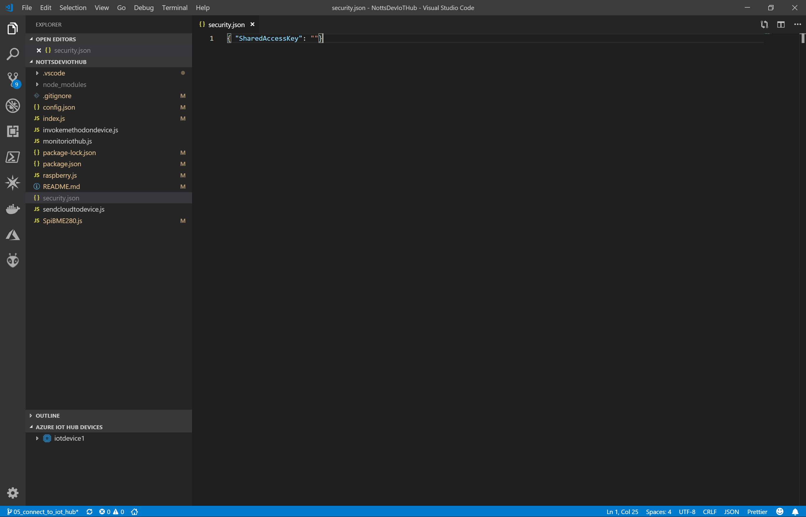
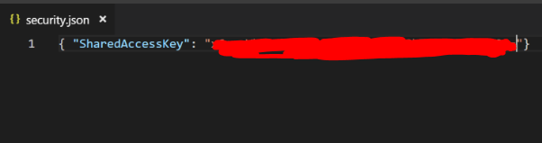
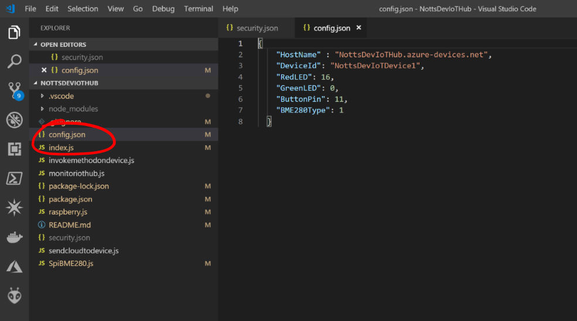
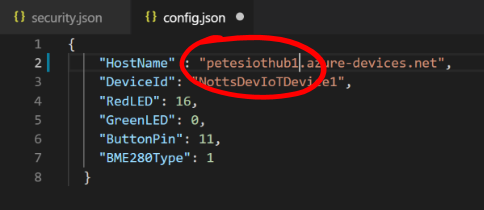
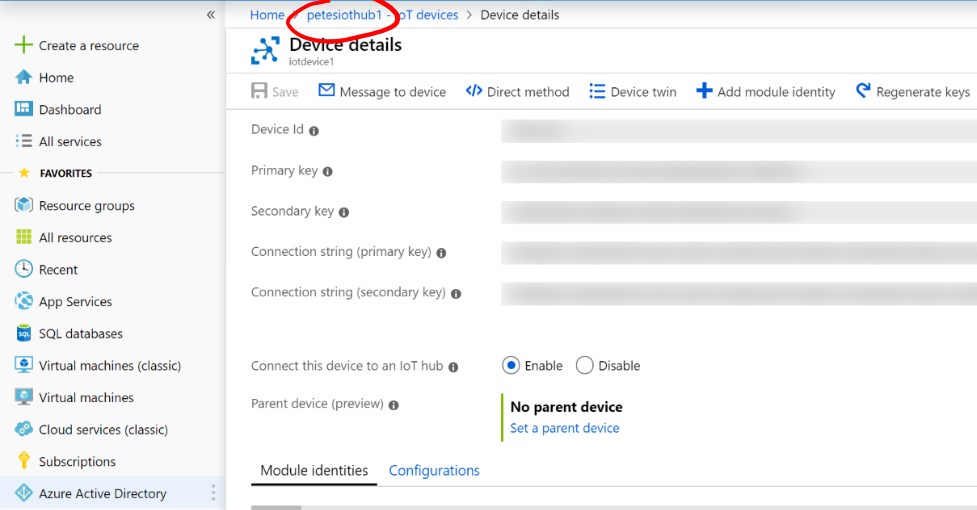
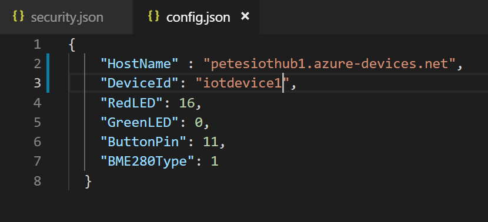

# 11 - Conncting the Raspberry Pi to the Azure IoT Hub #

We're now going to connect our Raspberry Pi to our Azure IoT Hub.

---

- Return to ```portal.azure.com```
- Make sure you’re in your new IoT Hub;

<p align="center">
    
</p>

- Under ```Explorers``` select ```IoT Devices```;

<p align="center">
    
</p>

- Click on iotdevice1;

<p align="center">
    
</p>

- Click the ```Copy```  icon next to ```Primary Key``` to copy the Primary Key to your clipboard;

<p align="center">
    
</p>

- Switch back to Visual Studio Code.
- Open ```security.json```;

<p align="center">
    
</p>

- Paste the Primary Key into the empty quotes ```""``` for the ```SharedAccessKey```;

<p align="center">
    
</p>

- Save the File.
- Open “config.json”;

<p align="center">
    
</p>

- Replace “NottsDevIoTHub” with the name of you IoTHub you chose in Step 6;

<p align="center">
    
</p>

- If you can't remember it, this is shown in the top left of your IoT Hub in Azure;

<p align="center">
    
</p>

- Replace ```NottsDevIoTDevice1``` with the ```iotdevice1```;

<p align="center">
    
</p>

- Save the File

| Previous | Next |
| -------- | ---- |
| [< Step 10 - Using Visual Studio Code IoT Toolkit](/10_vs_code_iot_toolkit/README.md) | [Step 12 - Test that the Raspberry Pi can connect to the IoT hub >](/12_test_pi_iot_hub_connection/README.md) |