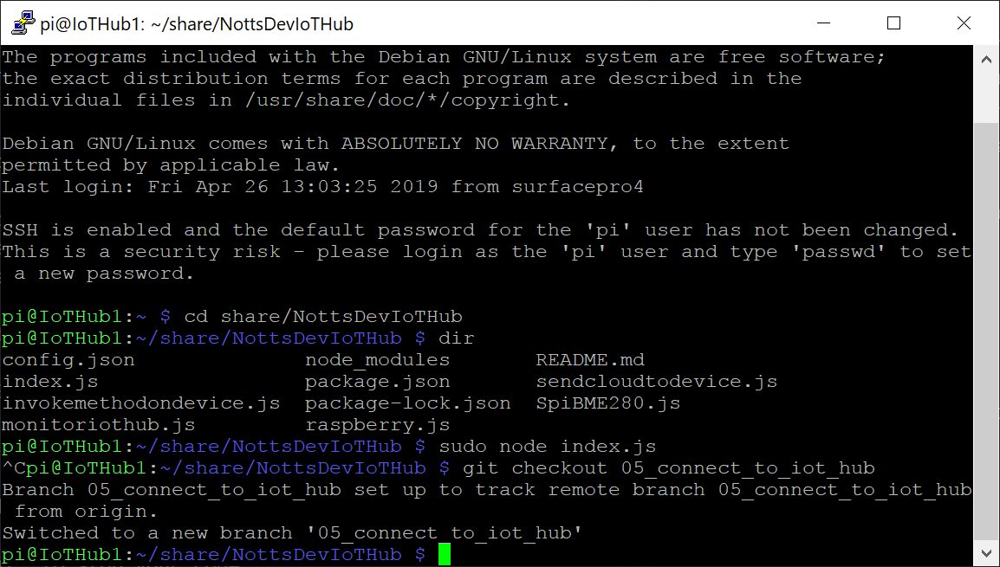
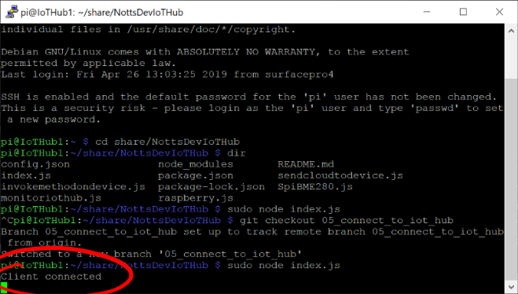

# 12 - Test that the Raspberry Pi can connect to the IoT Hub #

We're now going to run the latest version of our Raspberry Pi Code and make sure that it can connect to our new IoT hub.

---

- Return to PuTTY;

<p align="center">
    
</p>

- Make sure that your session is still active. If it has disconnected, you'll get a warning box. You'll then need to reconnect.
- Make sure your code isn’t still running – Press ```ctrl+c``` to stop it if it is.
- Type ```sudo node index.js``` (or press the up-cursor key) and press enter to run the code.
- Wait for the terminal to show “Client Connected”;

<p align="center">
    
</p>

- If you get an error, check that you’ve entered all the correct details and saved your files!

- Press ```ctrl+c``` to stop your code.

| Previous | Next |
| -------- | ---- |
| [< Step 11 - Connecting the Raspberry Pi to the IoT Hub](/11_connect_pi_to_iot_hub/README.md) | [Step 13 - Waiting for a Message from the Device (Device Explorer) >](/13_wait_for_device_msg_dev_explorer/README.md) |