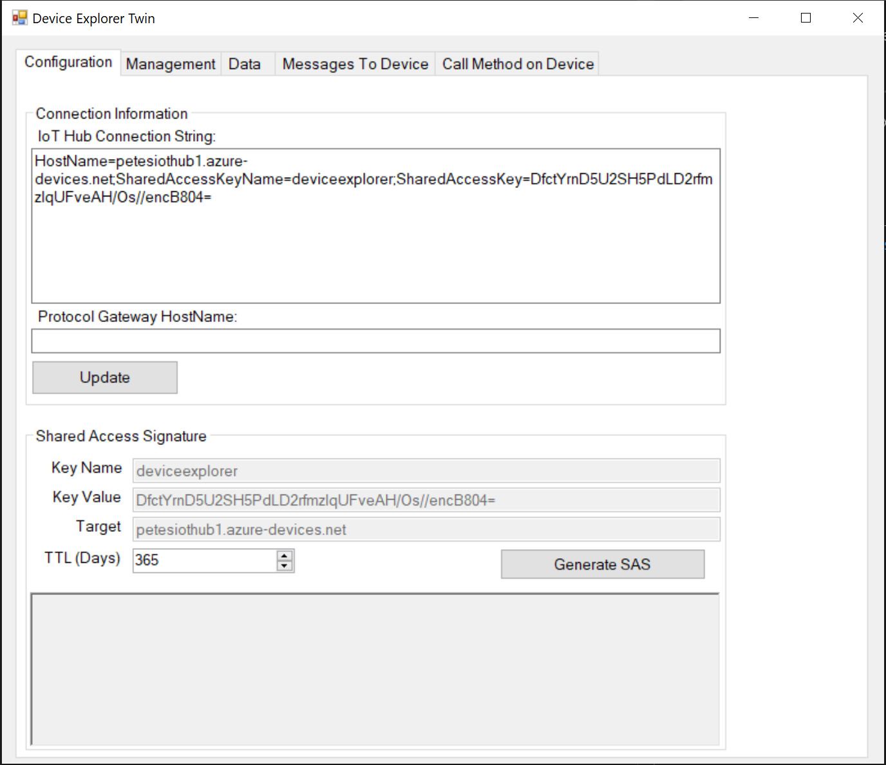
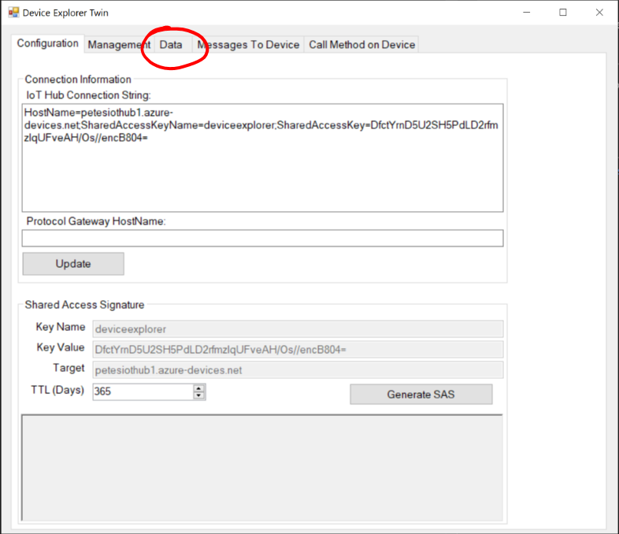
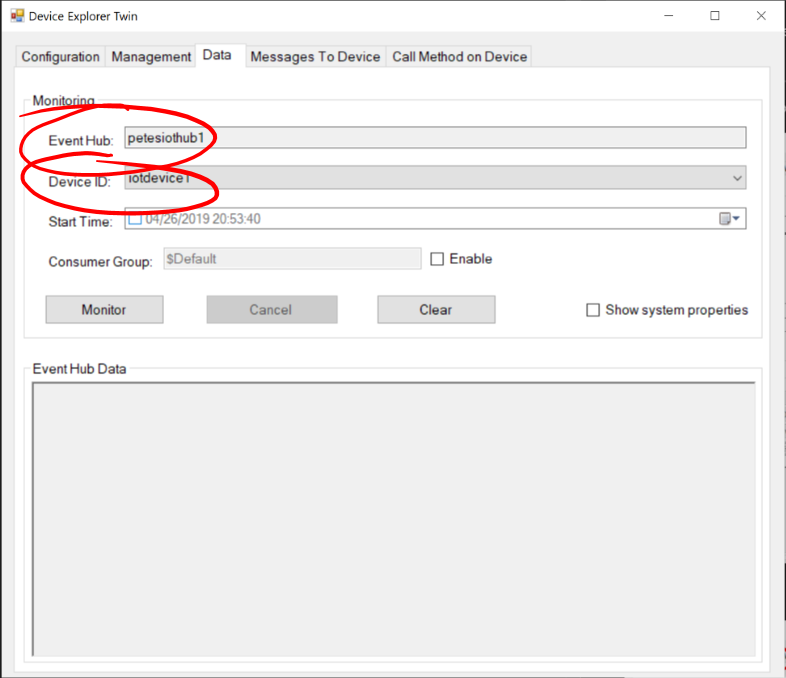
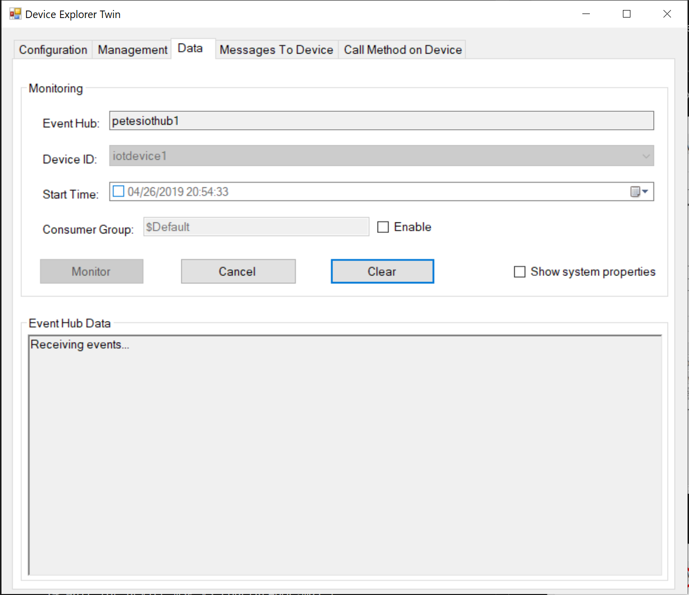

# 13 - Waiting for a Message from the Device (Device Explorer) #

We're now going to setup the Device Explorer Twin to listen to messages from our Raspberry Pi.

---

- Return to the Device Explorer Twin;

    

- Select the Data Tab.

    

- Make sure that The Event Hub and Device ID match those you chose in the steps above;

    

- Press the “Monitor” button to start monitoring for Device to Cloud messages.

    

| Previous | Next |
| -------- | ---- |
| [< Step 12 - Test that the Raspberry Pi can connect to the IoT Hub](/12_test_pi_iot_hub_connection/README.md) | [Step 14 - Waiting for a Message from the Device (VS Code) >](/14_wait_for_device_msg_vs_code/README.md) |