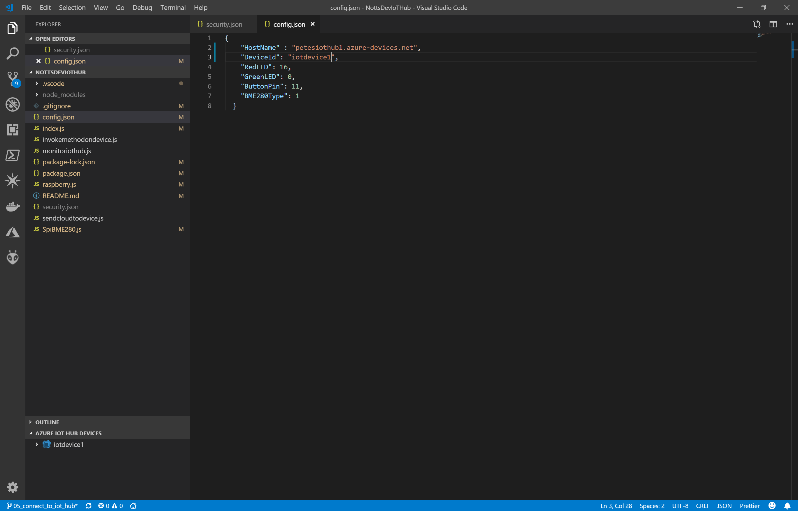
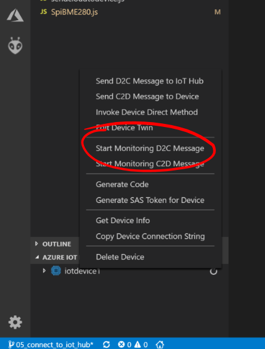
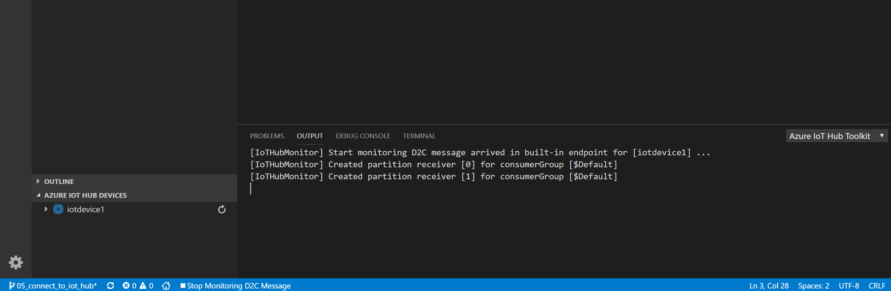

# 14 - Waiting for a Message from the Device (VS Code) #

We're now going to setup VS Code to listen to messages from our Raspberry Pi.

---

- Switch back to Visual Studio Code.

    

- Right click on the iotdevice1 item and select “Start Monitoring D2C” message.

    

- VS Code will open a new monitor window at the bottom of the screen;

    

| Previous | Next |
| -------- | ---- |
| [< Step 13 - Waiting for a Message from the Device (Device Explorer)](/13_wait_for_device_msg_dev_explorer/README.md) | [Step 15 - Sending a Message to the IoT Hub >](/15_send_msg_to_iot_hub/README.md) |