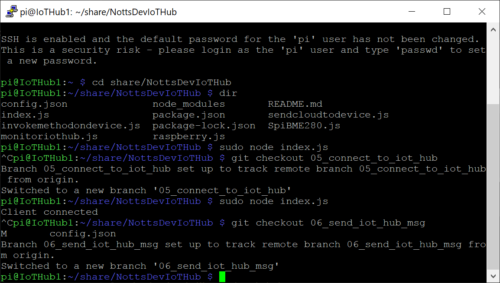

# 15 - Sending a Message to the IoT Hub #

We're now going to get the next version of Raspberry Pi Code. This version will automatically send a message to the IoT hub when it starts up... This message will show in our Device Explorer Twin or VS Code.

---

- Return to PuTTY, make sure that your session is still active;

<p align="center">
    
</p>

- Drag the PuTTY Window and the Device Explorer windows side by side;

<p align="center">
    
</p>

- Make sure your code isn’t still running – Press “ctrl+c” to stop it if it is.
- Type the following and press enter;

```git checkout 06_send_iot_hub_msg```

- The terminal should say ```Your branch is up-to-date with 'origin/06_send_iot_hub_msg '.```;

<p align="center">
    
</p>

- Type the following and press enter to run the code;

 ```sudo node index.js``` 

- Wait for the terminal to show “Client Connected”, then “Message Sent”;

<p align="center">
    
</p>

- You should see a message arrive in the Device Explorer;

<p align="center">
    
</p>

- You should also see a message arrive in VS Code;

<p align="center">
    
</p>

| Previous | Next |
| -------- | ---- |
| [Step 14 - Waiting for a Message from the Device (VS Code) >](/14_wait_for_device_msg_vs_code/README.md) | [Step 16 - Sending a Message to the IoT Hub on Button Press  >](/16_send_msg_to_iot_hub_button/README.md) |