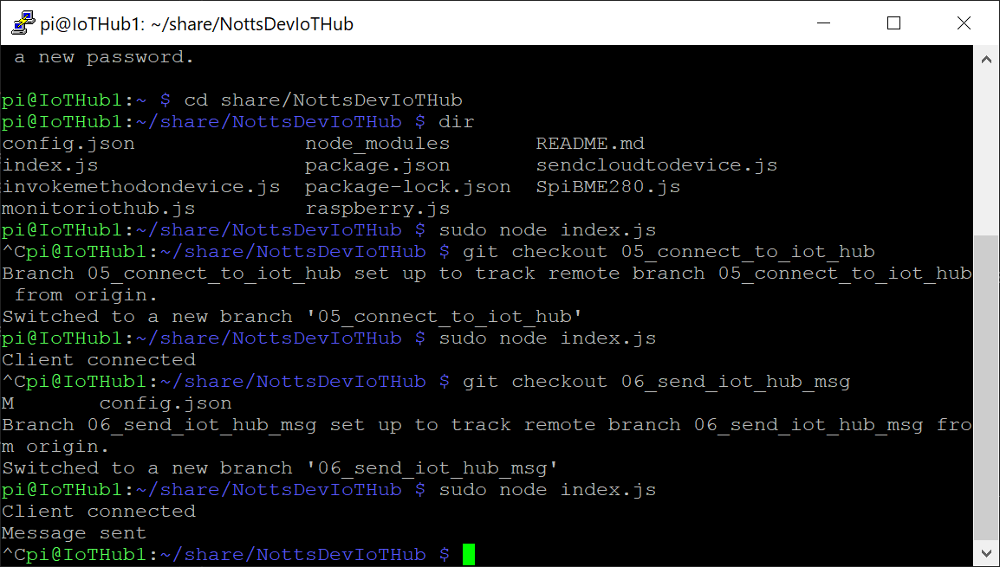
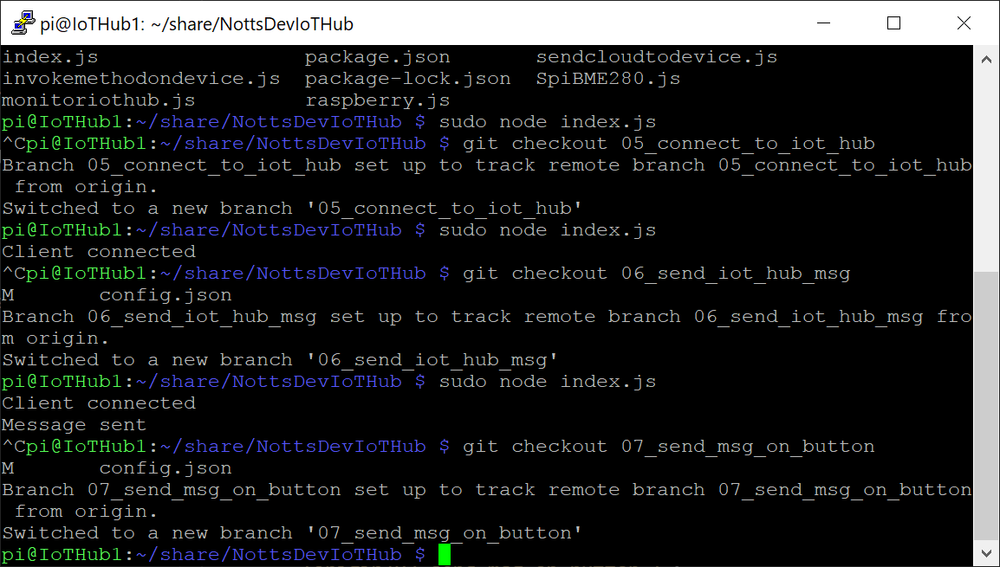
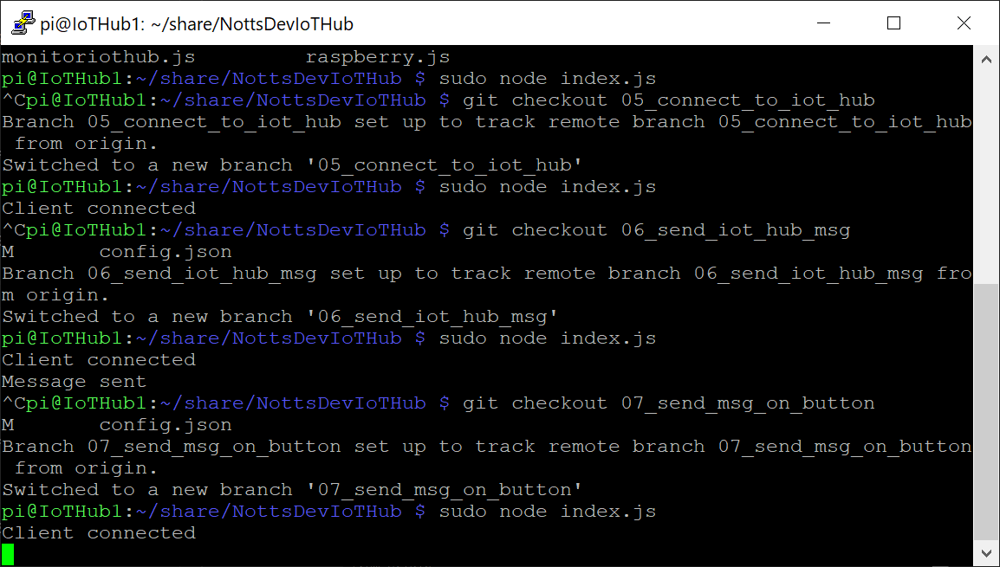
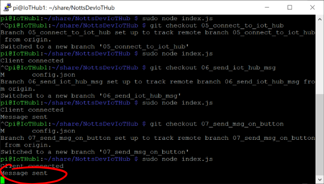
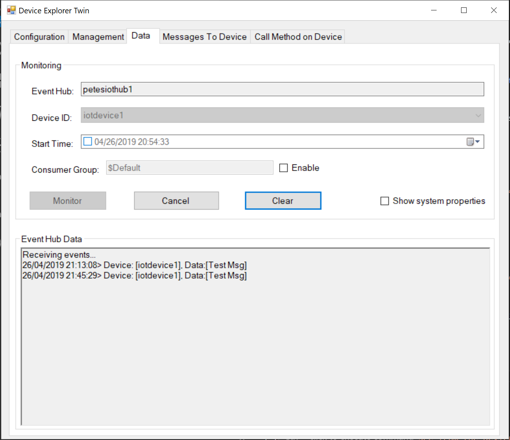
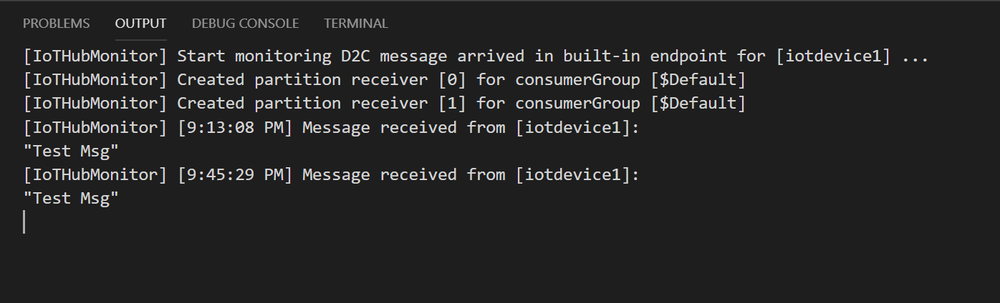

# 16 - Sending a Message to the IoT Hub on a Button Press #

We're now going to get the next version of Raspberry Pi Code. This version will send a message to the IoT hub when a Button is pressed... This message will show in our Device Explorer Twin or VS Code.

---

- Return to PuTTY, make sure that your session is still active;

<p align="center">
    
</p>

- Make sure your code isn’t still running – Press ```ctrl+c``` to stop it if it is.
- Type the following and press enter to get the next version of code;

```git checkout 07_send_msg_on_button```

- The terminal should say ```Your branch is up-to-date with 'origin/07_send_msg_on_button '.```;

<p align="center">
    
</p>

- Type the following and press enter to run the code;

```sudo node index.js``` 

- Wait for the terminal to show “Client Connected”;

<p align="center">
    
</p>

- Make sure that the Device Explorer or VS Code is still Monitoring Messages.
- Press the Button on the Bread Board.
- The Terminal should say “Message Sent”;

<p align="center">
    
</p>

- You should receive a message in the Data tab of the Device Explorer;

<p align="center">
    
</p>

- You should also see a message arrive in VS Code;

<p align="center">
    
</p>

| Previous | Next |
| -------- | ---- |
| [< Step 15 - Sending a Message to the IoT Hub](/15_send_msg_to_iot_hub/README.md) | [Step 17 - Receiving a Message from the IoT Hub on Button Press  >](/17_receive_msg_from_iot_hub/README.md) |