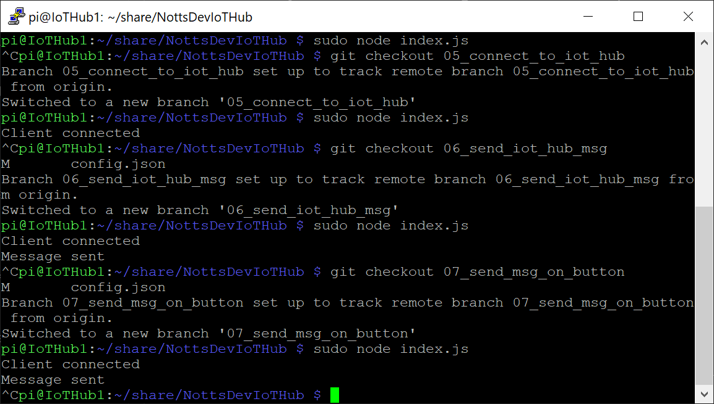
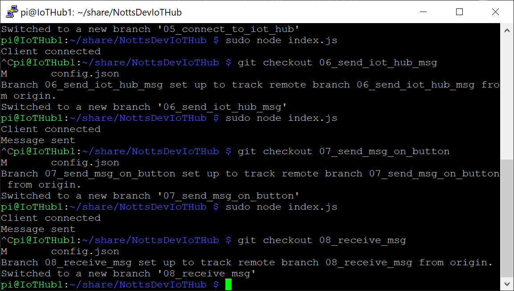
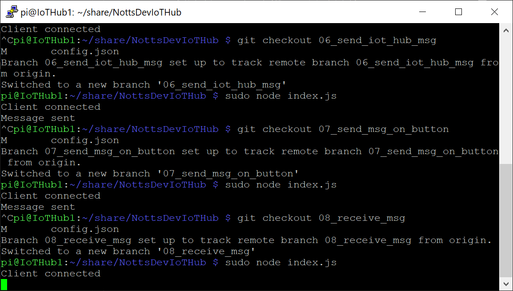

# 17 - Receiving a Message from the IoT Hub #

We're now going to get the next version of Raspberry Pi Code. This version will listen for messages from the IoT Hub and react to certain messages.

---

- Return to PuTTY, make sure that your session is still active;

<p align="center">
    
</p>

- Make sure your code isn’t still running – Press ```ctrl+c``` to stop it if it is.
- Type the following and press enter to get the next version of code;

```git checkout 08_receive_msg```

- The terminal should say ```Your branch is up-to-date with 'origin/08_receive_msg '.```;

<p align="center">
    
</p>

- Type the following and press enter to run the code;

```sudo node index.js``` 

- Wait for the terminal to show “Client Connected”;

<p align="center">
    
</p>

| Previous | Next |
| -------- | ---- |
| [< Step 16 - Sending a Message to the IoT Hub on Button Press](/16_send_msg_to_iot_hub_button/README.md) | [Step 18 - Sending a Message from the IoT Hub to the Raspberry Pi  >](/18_send_msg_from_hub_to_pi/README.md) |