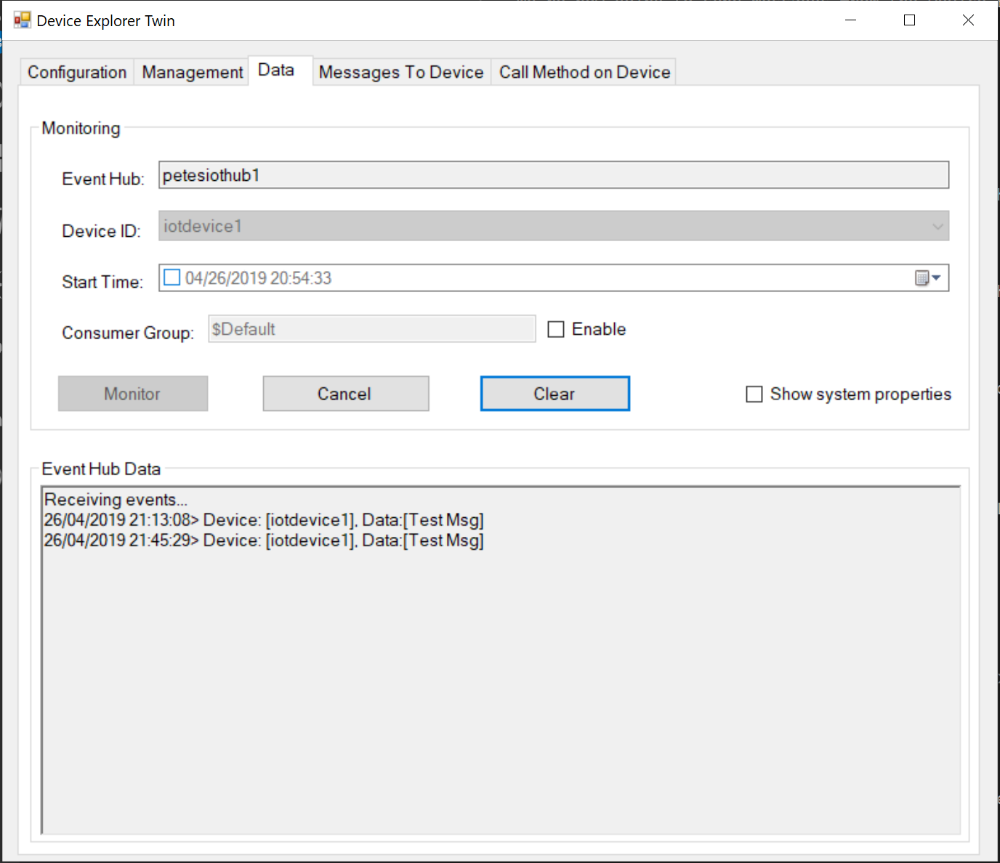
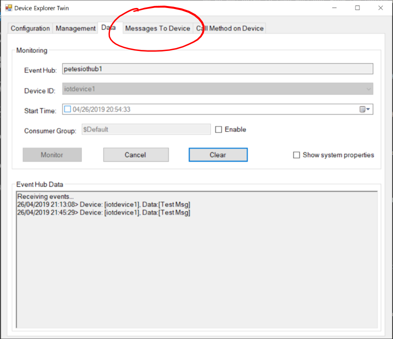
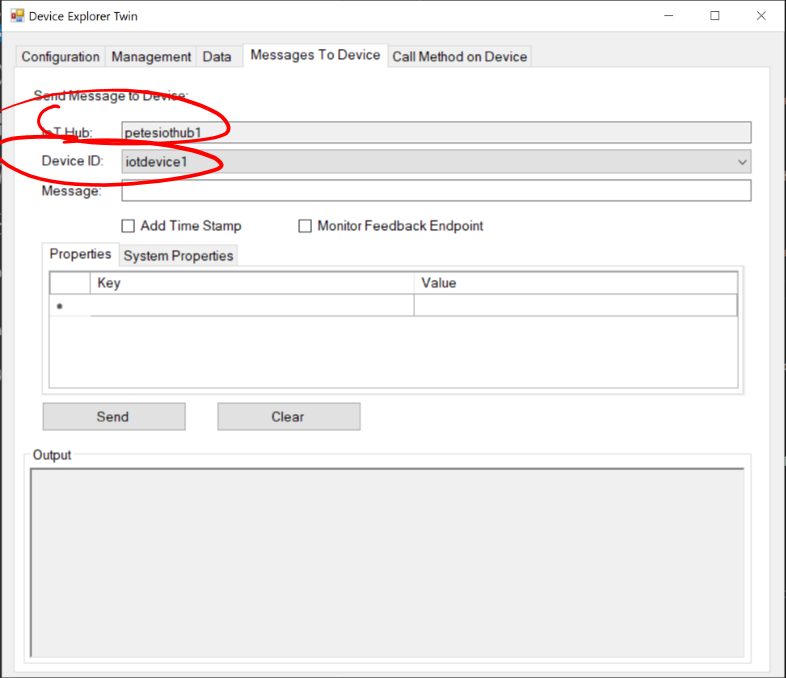
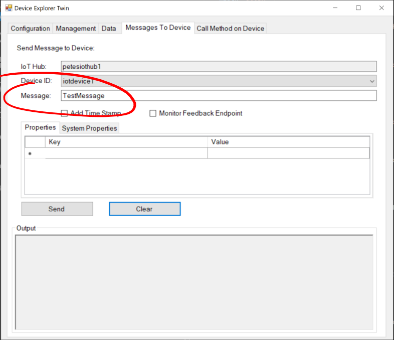
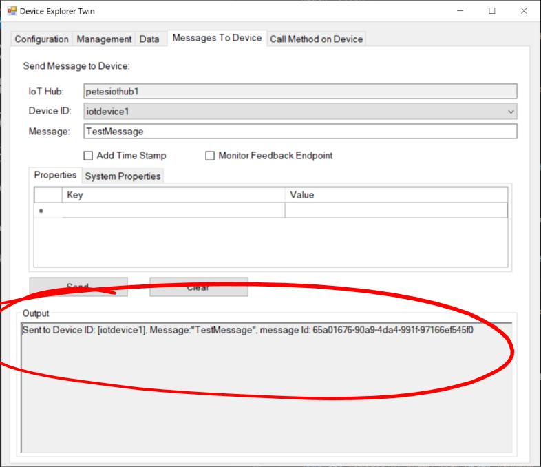
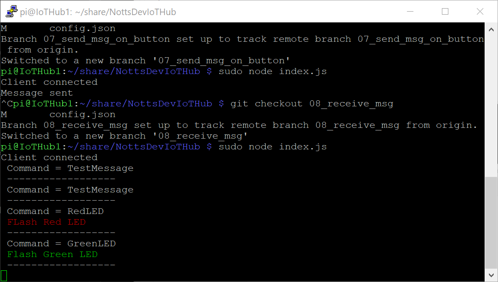

# 18 - Sending a Message from the IoT Hub to the Raspberry Pi #

We're now going to send messages from the Device Explorer Twin to our Raspberry Pi.

---

- Switch back to the Device Explorer;

<p align="center">
    
</p>

- Select the “Messages To Device” tab;

<p align="center">
    
</p>

- Make sure that The Event Hub and Device ID match those you chose in the steps above;

<p align="center">
    
</p>

- In the ```Message``` box type ```TestMessage```

<p align="center">
    
</p>

- Press the “Send” button.
- You should see a status message that the message was sent;

<p align="center">
    
</p>

- Switch back to PuTTY and the terminal should show something like ```Command = TestMessage```;

<p align="center">
    
</p>

- Try sending ```RedLED``` and ```GreenLED``` to see the LEDs Flash;

<p align="center">
    
</p>

| Previous | Next |
| -------- | ---- |
| [< Step 17 - Receiving a Message from the IoT Hub on Button Press](/17_receive_msg_from_iot_hub/README.md) | [Step 19 - Sending a Message from the IoT Hub to the Raspberry Pi (VS Code) >](/19_send_msg_from_hub_to_pi_vs_code/README.md) |