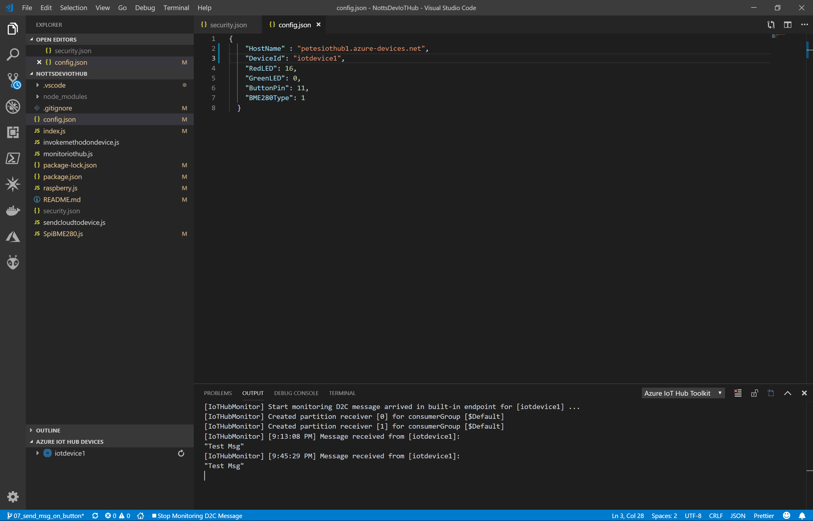
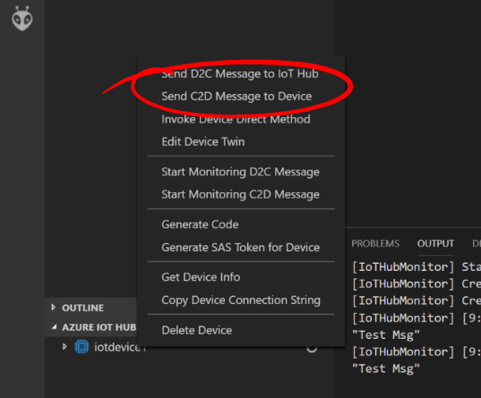
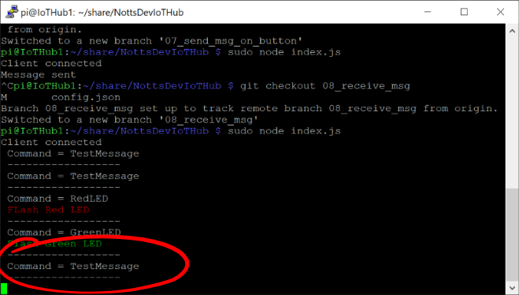
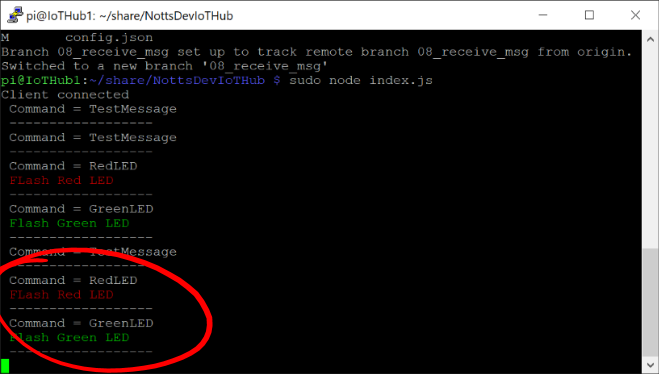

# 19 - Sending a Message from the IoT Hub to the Raspberry Pi (VS Code) #

We're now going to send messages from VS Code to our Raspberry Pi.

---
- Switch back to Visual Studio Code;

<p align="center">
    
</p>

- Right click on the ```iotdevice1``` item and press ```Send C2D message to device```;

<p align="center">
    
</p>

- In the ```Message``` prompt at the top type ```TestMessage``` and press the Enter Key to send the Message;

<p align="center">
    
</p>

- Switch back to PuTTY and the terminal should show something like ```Command = TestMessage```;

<p align="center">
    
</p>

- Try sending ```RedLED``` and ```GreenLED``` to see the LEDs Flash;

<p align="center">
    
</p>

- Press ```ctrl + c``` to stop your code.

| Previous | Next |
| -------- | ---- |
| [< Step 18 - Sending a Message from the IoT Hub to the Raspberry Pi](/18_send_msg_from_hub_to_pi/README.md) | [Step 20 - Invoke a Method on the Pi - Setup >](/20_invoke_method_on_pi_setup/README.md) |