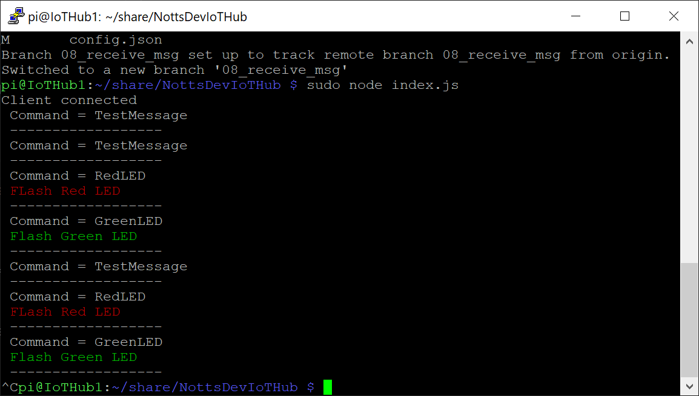
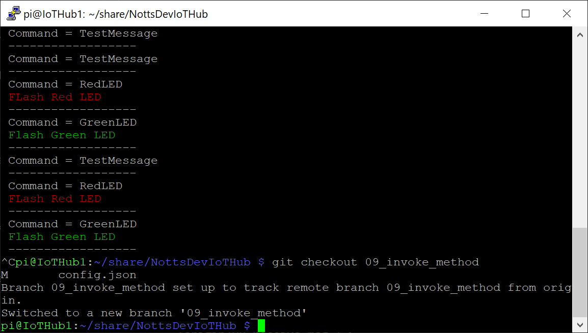
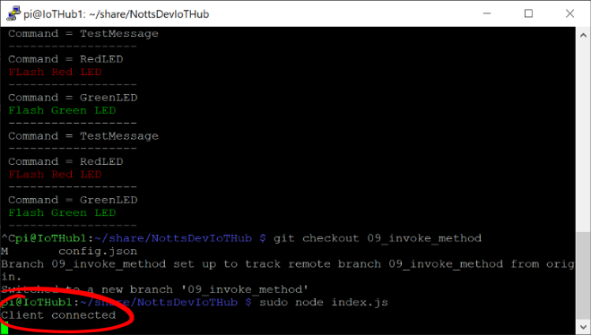

# 20 - Invoking a Method on the Raspberry Pi - Setup #

We're now going to get the next version of Raspberry Pi Code. This version will listen for a specific command from the IoT Hub and react control the LEDs on our breadboard.

---

- Return to PuTTY, make sure that your session is still active;

<p align="center">
    
</p>

- Make sure your code isn’t still running – Press ```ctrl+c``` to stop it if it is.
- Type the following and press enter to get the next version of code;

```git checkout 09_invoke_method```

- The terminal should say ```Your branch is up-to-date with 'origin/08_receive_msg '.```;

<p align="center">
    
</p>

- Type the following and press enter to run the code;

```sudo node index.js``` 

- Wait for the terminal to show “Client Connected”;

<p align="center">
    
</p>

| Previous | Next |
| -------- | ---- |
| [< Step 19 - Sending a Message from the IoT Hub to the Raspberry Pi (VS Code)](/19_send_msg_from_hub_to_pi_vs_code/README.md) | [Step 21 - Invoking a Method from the IoT Hub (Device Explorer)  >](/21_invoke_method_device_explorer/README.md) |