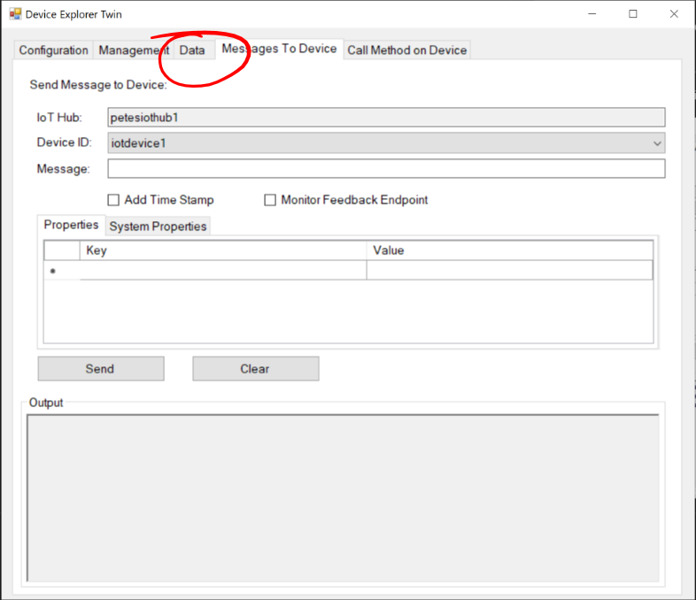

# 21 - Invoking a Method on the Raspberry Pi (Device Explorer) #

We're now going to Invoke a Command on the Raspberry Pi from the Device Explorer Twin.

---

- Switch back to the Device Explorer;

<p align="center">
    
</p>

- Click the ```Data``` tab;

<p align="center">
    
</p>

- Click the Cancel Button to stop Monitoring;

<p align="center">
    
</p>

- Click the “Call Method On Device” tab;

<p align="center">
    
</p>

- Make sure that The Event Hub and Device ID match those you chose in the steps above;

<p align="center">
    
</p>

- In the “Method Name” box type ```getReadings```;

<p align="center">
    
</p>

- Press the “Call Method” button.
- The Return Payload box should show something like the following;

<p align="center">
    
</p>

- Switch back to PuTTY, and the terminal should show something like the following;

<p align="center">
    
</p>

| Previous | Next |
| -------- | ---- |
| [< Step 20 - Invoke a Method on the Pi - Setup](/20_invoke_method_on_pi_setup/README.md) | [Step 22 - Invoking a Method from the IoT Hub (VS Code)  >](/22_invoke_method_vs_code/README.md) |