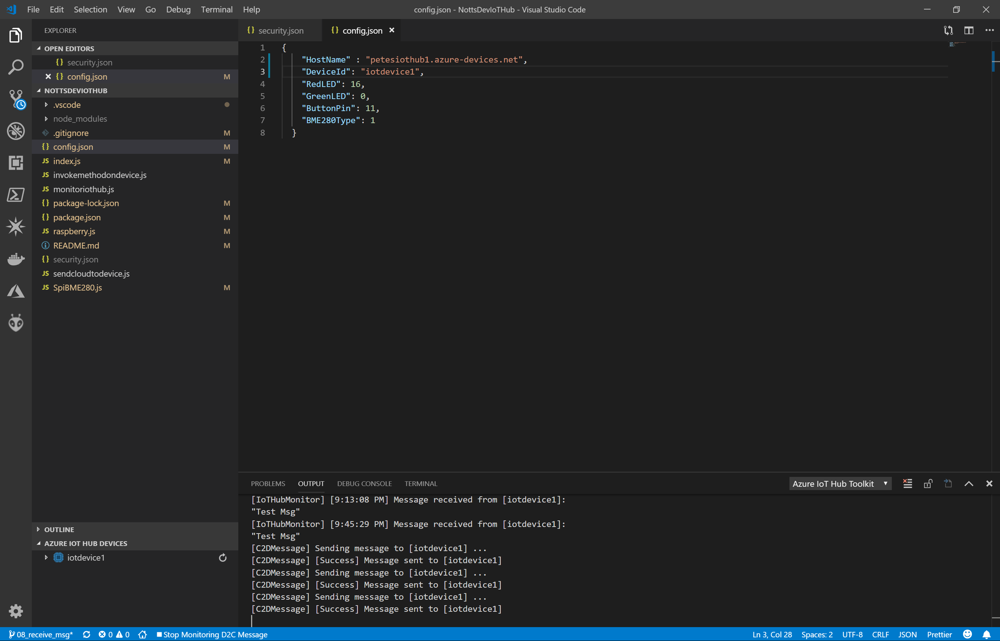
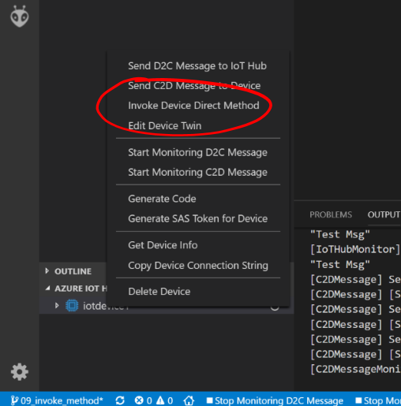
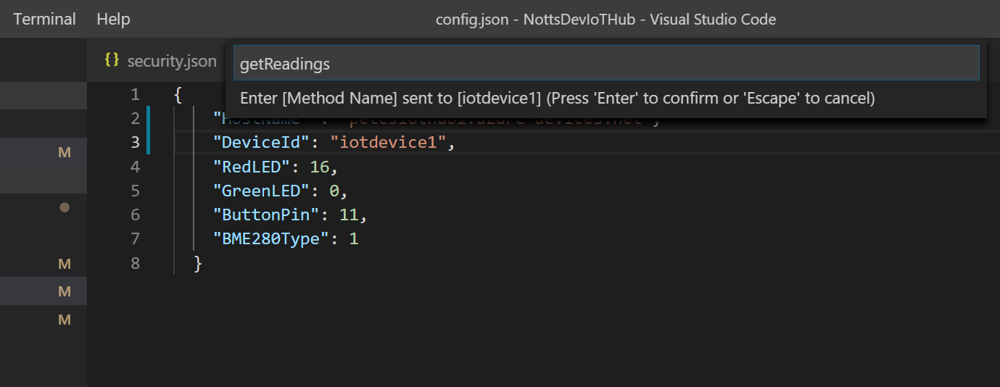
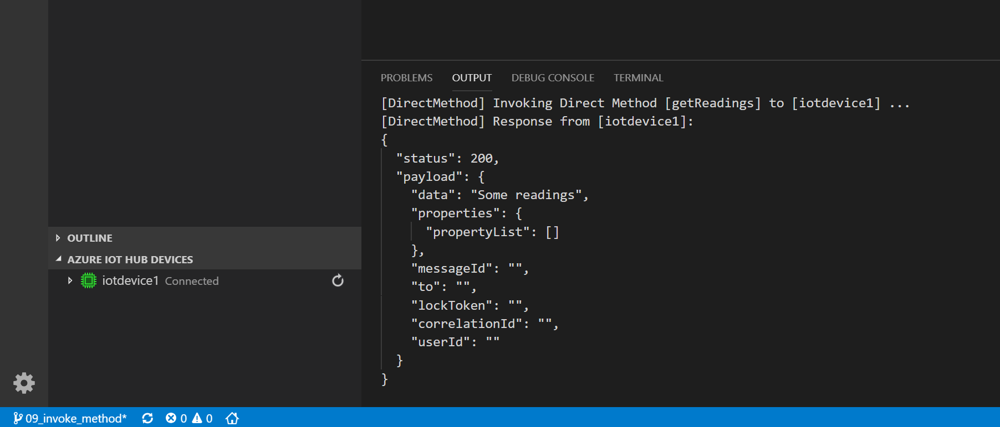

# 22 - Invoking a Method on the Raspberry Pi (VS Code) #

We're now going to Invoke a Command on the Raspberry Pi from Visual Studio Code.

---

- Switch back to Visual Studio Code.

<p align="center">
    
</p>

- Right click on the ```iotdevice1``` item again and press ```Invoke Direct Method```

<p align="center">
    
</p>

- In the ```Enter Method Name``` prompt at the top type ```getReadings``` and press the Enter Key In the ```Enter Payload``` prompt just press the Enter Key to Invoke the Method;

<p align="center">
    
</p>

- The VS Code Output Window should show;

<p align="center">
    
</p>

| Previous | Next |
| -------- | ---- |
| [< Step 21 - Invoking a Method from the IoT Hub (Device Explorer)](/21_invoke_method_device_explorer/README.md) | [Step 23- Adding a Temperature Sensor >](/23_add_temp_sensor/README.md) |